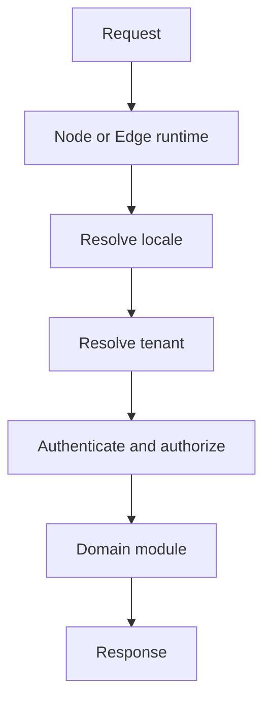

# Platform Patterns

Runtime selection, locale routing, tenant resolution, and monorepo boundaries affect every feature. Model them as platform capabilities with explicit contracts rather than scattered conventions.

The order and trust model must be documented, tested, and observable.