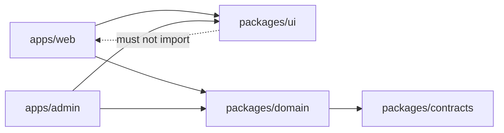

# Next.js in Monorepos

A monorepo should create enforceable product boundaries, not a shared folder where every application imports everything.

## Typical structure

```text
apps/
  web/
  admin/
packages/
  ui/
  domain-billing/
  api-client/
  config-eslint/
  config-typescript/
```

Use npm, pnpm, or Yarn workspaces consistently. Turborepo can coordinate task graphs and remote caching, but correctness still depends on declared inputs and outputs.

## Package contracts

- Export public entry points; block deep imports.
- Separate server-only and client-safe exports.
- Keep Node-specific dependencies out of browser packages.
- Use `transpilePackages` only for packages that need framework transpilation.
- Avoid importing application code back into shared packages.



## Build cache safety

Cache keys must include source, lockfile, environment inputs, generated files, and relevant configuration. Secret values should not be copied into cache artifacts.

## Deployment

Deploy applications independently. Determine affected projects from the dependency graph, but still run shared contract and integration tests when a common package changes.

## Governance

Assign package owners, document stability levels, enforce dependency direction, publish architecture decisions, and measure build duration and cache hit rate. A large monorepo without boundaries becomes a distributed monolith inside one Git repository.