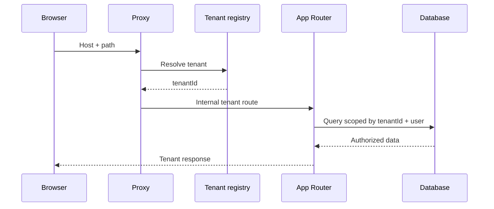

# Multi-Tenant Applications

Multi-tenancy is primarily an isolation problem. Branding and custom domains are secondary to preventing cross-tenant data access and cache leakage.

## Resolution strategies

- Subdomain: `acme.example.com`.
- Path: `example.com/acme/...`.
- Custom domain: `app.acme.com`.

Resolve the host or path through a trusted tenant registry. Normalize host names, handle preview domains explicitly, and reject unknown tenants.

## Isolation rules

- Derive `tenantId` on the server; never trust a hidden form field alone.
- Scope every object query to tenant and actor.
- Include tenant in cache keys and tags.
- Partition files, jobs, webhooks, search indexes, and analytics.
- Test cross-tenant object identifiers as a security regression suite.

## Authentication and authorization

Authentication identifies the user. Membership establishes tenant access. Permission checks authorize an action on a tenant resource. Repeat these checks in Server Functions and Route Handlers even when the UI and Proxy already gated navigation.

## Custom domains and metadata

Store verified domain ownership, canonical origin, theme, locale, and metadata per tenant. Prevent an unverified host from controlling redirects, cookies, or canonical URLs.

## Database models

Shared-schema databases require a tenant key on every tenant-owned table and index. Separate schemas or databases increase isolation but add operational complexity. Choose based on risk, scale, compliance, and restore requirements.