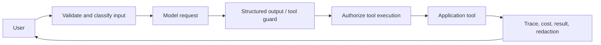

# Feature Flags, Search, AI, and Audit Logs

## Feature flags

Evaluate security-sensitive flags on the server. Define owner, purpose, audience, expiry date, fallback, and cleanup issue. Cache flag configuration carefully; a stale kill switch can prolong an incident.

## Experiments

Assign variants consistently, avoid exposing private targeting attributes, and log assignment separately from conversion. Do not let an experiment bypass authorization or accessibility requirements.

## Search

Treat the search index as a derived read model. Index from durable events, include tenant and visibility filters, and tolerate eventual consistency. Escape or validate query syntax, cap result size, and prevent private records from entering public indexes.

## AI features

Build a policy boundary between the model and application tools:

Use structured schemas, tool allowlists, least-privilege credentials, prompt-injection defenses, retrieval access controls, token budgets, latency timeouts, fallbacks, and evaluation datasets. Never let model text become an authorization decision.

## Audit logs

Audit events answer who performed what action, on which resource, for which tenant, when, from which request, and with what outcome. Make them append-only at the application level, redact secrets, protect access, define retention, and distinguish audit evidence from high-volume debug logs.

## Operational review

Flags, search indexing, AI calls, and audit delivery need dashboards and alerts. Test provider outage, stale configuration, index lag, unsafe model output, duplicate events, and partial write failures.