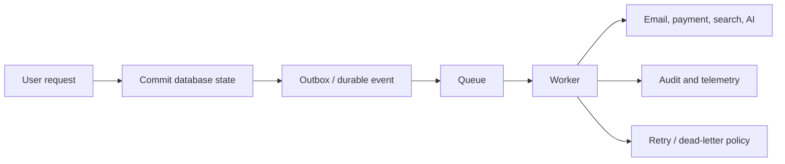

# Production Patterns

Production Next.js systems extend beyond request/response pages. They coordinate durable jobs, third-party side effects, uploads, notifications, payments, search, AI features, flags, experiments, and audit evidence.

Do not rely on an in-process promise after returning a response for business-critical work. Durable effects require durable state, idempotency, retries, and observability.