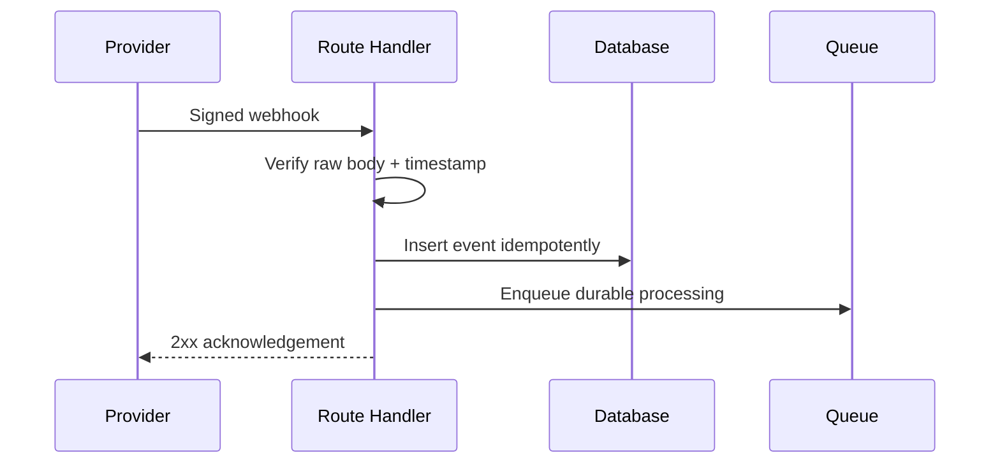

# Jobs, Webhooks, Files, Email, and Payments

## Background jobs

Use a queue or managed workflow system for work that must survive process restarts: image processing, exports, billing, email, search indexing, and AI generation. Store job identity, tenant, attempt, deadline, and idempotency key. Bound retries and route poison messages to a dead-letter workflow.

## Transactional outbox

When a database write and an external effect must stay consistent, write the domain change and an outbox record in one transaction. A worker publishes the outbox record and marks it complete. This avoids losing an event between commit and enqueue.

## Webhooks

Verify the signature against the raw request body, enforce timestamp tolerance, store the provider event ID, and acknowledge duplicates safely. Return quickly; process expensive work asynchronously.

## File uploads

Prefer direct-to-object-storage uploads with short-lived signed URLs. Validate size, content type, extension, and magic bytes; randomize object keys; scan untrusted files; and process them outside the request. Never serve user uploads as executable same-origin content.

## Email

Render deterministic templates, separate transactional from marketing consent, record provider message IDs, handle bounces and complaints, and avoid putting secrets in email links. Tokenized links need short expiry, one-time use, and server-side validation.

## Payments

Create payment intents or checkout sessions on the server using server-authoritative prices. Confirm fulfillment from verified webhooks, not from a browser redirect. Make order creation and webhook handling idempotent, and reconcile provider state with local state.

## Observability

Track queue depth, oldest job age, attempts, dead letters, provider latency, webhook verification failures, upload scan results, email delivery, and payment reconciliation.