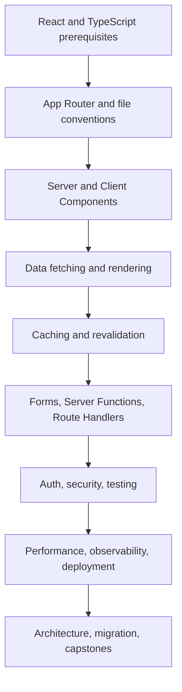

# Next.js Learning Roadmap

Use the handbook in stages. Do not jump to caching, Server Functions, or platform architecture before the server/browser boundary is clear.

## Beginner

Build routes, layouts, loading UI, error UI, metadata, links, images, and forms. Explain which code runs on the server and which code reaches the browser.

## Productive App Router developer

Fetch data in Server Components, use Suspense intentionally, design Client Component boundaries, implement validated mutations, and choose static or dynamic rendering based on data requirements.

## Full-stack engineer

Own authentication, authorization, database access, route handlers, webhooks, uploads, caching, revalidation, tests, and deployment behavior.

## Senior engineer

Debug hydration and cache incidents, control client JavaScript, model failure contracts, design observability, perform safe migrations, and make runtime/deployment trade-offs.

## Staff-level engineer

Define module boundaries, multi-tenant isolation, platform capabilities, monorepo contracts, delivery governance, performance budgets, SLOs, and rollback strategy for multiple teams.

## Practice loop

For every section:

1. Read the mental model.
2. Rebuild the smallest working example.
3. Add validation, authorization, error handling, and tests.
4. Explain caching and runtime behavior aloud.
5. Complete the related interview and design-review questions.
6. Apply the topic to one capstone.