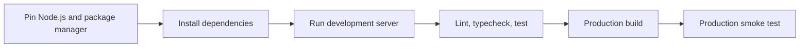

# Installation and Project Setup

A reliable Next.js project begins with a reproducible runtime, package-manager policy, strict TypeScript settings, explicit linting, and a build that behaves the same locally and in CI.

## Learning order

1. Create a project with the supported `create-next-app` command.
2. Understand every generated option.
3. Learn the manual installation path.
4. Configure aliases, environment files, linting, formatting, editor tooling, and debugging.
5. Run the development server, production build, and production server.

## Setup contract

A project is not set up until a clean checkout can install, validate, build, and start without undocumented local state.