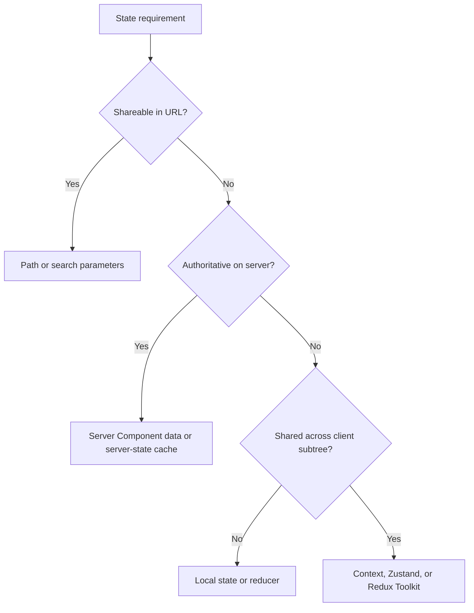

# State Management

State in Next.js belongs to different owners. Choosing a library before classifying the state usually creates duplication and hydration bugs.

The default is no global store. Prefer server data, URL state, and local component state until a real cross-tree client requirement appears.