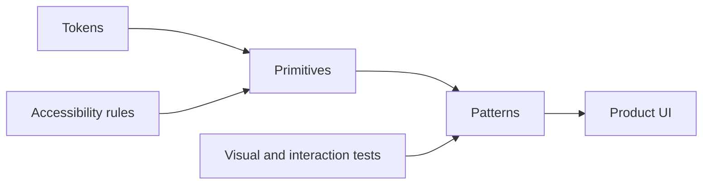

# CSS, Tailwind, Sass, and Design Systems

## Global CSS

Import global CSS from a root or nested layout when the rules belong to that application shell. Keep resets, typography, tokens, and truly global utilities there; avoid turning the global cascade into a hidden component API.

## CSS Modules

CSS Modules provide local class names without client JavaScript.

```tsx title="components/card.tsx"
import styles from './card.module.css'

export function Card({ title }: Readonly<{ title: string }>) {
  return <article className={styles.card}><h2>{title}</h2></article>
}
```

They work naturally in Server and Client Components because the generated CSS is a build artifact, not runtime state.

## Tailwind CSS

Tailwind is effective when the team standardizes tokens, component recipes, and class composition. Avoid arbitrary values that silently fork the design system. Keep conditional class logic readable and test visible states rather than implementation strings.

## Sass

Sass can organize legacy variables and mixins, but CSS custom properties are often better for runtime theming. Do not expose Sass compilation as a substitute for semantic tokens.

## Design-system architecture

- **Tokens:** color, spacing, typography, elevation, motion.
- **Primitives:** Button, Input, Dialog, Stack.
- **Patterns:** FormField, DataTable, Navigation.
- **Product components:** domain-specific composition.



## Performance and accessibility

Prevent layout shift by reserving space, loading fonts through `next/font`, and avoiding JavaScript-driven layout when CSS can express the behavior. Ensure focus, hover, active, disabled, error, high-contrast, and reduced-motion states are part of the component contract.