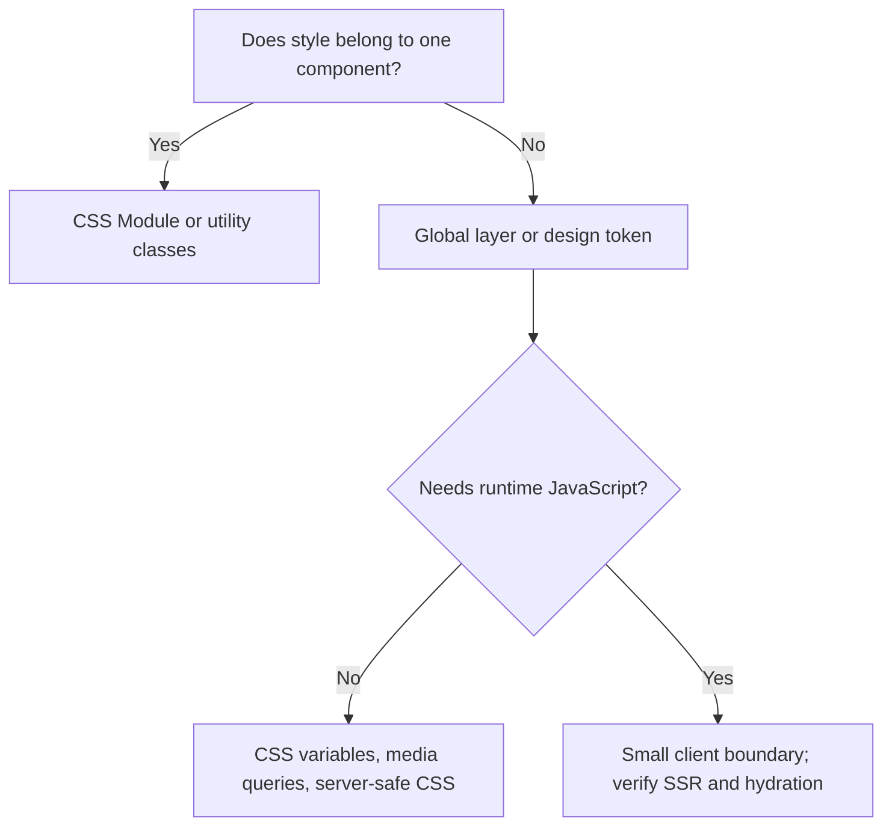

# Styling

Next.js supports several styling approaches, but production systems need one ownership model for global rules, component styles, tokens, themes, and third-party CSS.

## Decision model

Prefer server-compatible CSS. Runtime styling libraries must prove Server Component compatibility, deterministic SSR output, streaming behavior, CSP support, and acceptable client cost.