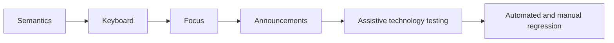

# Accessibility

Server rendering improves initial availability, but it does not make an interface accessible automatically.

## Semantic structure

Use landmarks, headings in a logical hierarchy, native buttons and links, labels for controls, and tables only for tabular data. Prefer native behavior before adding ARIA.

## Navigation and focus

Client-side navigation changes content without a full document reload. Provide a meaningful page title and heading, preserve expected browser history, and move focus only when the interaction requires it. Route-driven dialogs must restore focus to the opener when they close.

## Loading and errors

- Loading indicators need an accessible name when the state is not obvious.
- Skeletons should not create noisy announcements.
- Form errors must be linked to fields and summarized when appropriate.
- Error boundaries should expose a recovery action with clear focus behavior.
- Optimistic UI must announce eventual failure and rollback.

## Forms

Use visible labels, field descriptions, `aria-invalid` only when invalid, and `aria-describedby` for contextual errors. Do not rely on placeholder text or color alone.

## Motion and media

Respect `prefers-reduced-motion`, provide captions/transcripts, use meaningful alternative text, and avoid autoplaying disruptive media.

## Testing

Combine automated checks with keyboard-only navigation, screen reader smoke tests, zoom/reflow checks, reduced-motion checks, and high-contrast testing. Include accessibility assertions in component and end-to-end tests.

Accessibility acceptance criteria belong in the feature definition, not a final audit.