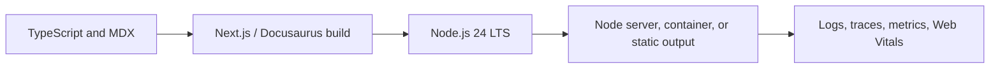

# Version Baseline

**Research date:** August 2, 2026

| Layer | Handbook baseline | Status |
|---|---:|---|
| Next.js | 16.2.11 | Active LTS security baseline |
| Next.js 16.3 | Preview channel | Evaluate separately; do not present preview behavior as a stable contract |
| React | 19.2.8 | Current React 19.2 patch used by this repository |
| Node.js | 24 LTS | Recommended production runtime for this handbook and CI |
| TypeScript | Strict mode | TypeScript-first examples; validate external data at runtime |
| Router | App Router | Primary path |
| Bundler | Turbopack | Default for development and production builds in Next.js 16 |
| Linting | Explicit script | `next build` does not replace a dedicated lint command |

## Supported project creation baseline

```bash
npx create-next-app@latest my-app --yes
cd my-app
npm run dev
```

The current default setup includes TypeScript, Tailwind CSS, ESLint, App Router, Turbopack, and the `@/*` import alias. Teams may choose different options, but the decision must be intentional and documented.

## Stability labels

- **Stable:** safe to teach as the default public API.
- **Preview:** suitable for evaluation behind a controlled rollout; behavior may change.
- **Experimental:** never treat as a durable platform contract.
- **Legacy / Pages Router:** supported for maintenance or migration, not the primary architecture.
- **Deprecated:** include only to explain migration away from it.

## Runtime baseline

Next.js requires Node.js 20.9 or newer. This repository standardizes CI on Node.js 24 LTS so local development, validation, and deployment use one maintained runtime line.



## Feature policy

Examples in the main learning path must work on Next.js 16.2.x. A page may discuss 16.3 preview features only when it clearly marks the release channel, fallback, adoption risk, and migration path.

## Primary sources

- [Next.js installation](https://nextjs.org/docs/app/getting-started/installation)
- [Next.js 16.2 release](https://nextjs.org/blog/next-16-2)
- [Next.js security update, July 20, 2026](https://nextjs.org/blog/security-update-2026-07-20)
- [React 19.2](https://react.dev/blog/2025/10/01/react-19-2)
- [Node.js release schedule](https://nodejs.org/en/about/previous-releases)