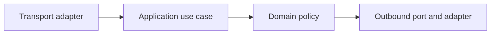

# Clean, Hexagonal and Vertical-Slice Architecture

## Concept

Architecture styles control dependency direction and group code around policies, ports, adapters, or use cases.

## Why It Exists

They help keep business rules independent from HTTP frameworks, databases, queues, and providers when that independence has value.

## Mental Model



Treat every arrow as a boundary with a cost, ownership rule, cancellation behavior, and failure mode. Node.js is effective when those boundaries are explicit instead of hidden behind framework defaults.

## How It Works

The JavaScript callback runs on the main JavaScript thread. Native Node.js bindings, libuv, the operating system, worker threads, child processes, or remote services may perform work elsewhere. Completion only becomes useful when control returns to JavaScript. Under load, the important questions are what is queued, what is bounded, what can be cancelled, and which resource saturates first.

## Example

```ts
interface PaymentPort {
  charge(input: {amountCents: number; idempotencyKey: string}): Promise<{paymentId: string}>;
}

class CompleteOrder {
  constructor(private readonly payments: PaymentPort) {}
  async execute(orderId: string, amountCents: number) {
    const payment = await this.payments.charge({amountCents, idempotencyKey: orderId});
    return {orderId, paymentId: payment.paymentId};
  }
}
```

The example is intentionally small enough to execute, but the production boundary is the important part: validate inputs, establish a deadline, propagate cancellation, classify failures, and release resources deterministically.

## Production Use

Select boundaries around volatile infrastructure and important policies, use vertical slices for cohesive delivery, and avoid one universal folder template.

## Security

Ports should prevent infrastructure data or authorization assumptions from leaking into domain decisions.

## Performance

Extra abstractions add calls, files, types, and cognitive load. Keep hot data paths visible and measure adapter behavior.

## Common Mistakes

- Creating interfaces for every class.
- Putting framework decorators on domain entities.
- A shared domain package with every service's models.

## Debugging

Trace a request through one use case and identify where data shape, ownership, errors, and transactions change.

## Testing

Test domain/use cases with controlled ports and adapters with real infrastructure contracts.

## When Not to Use It

Do not apply enterprise layering to a tiny script with no meaningful policy or volatile adapter.

## Interview Questions

- What is dependency inversion?
- Ports and adapters vs clean architecture?
- What is a vertical slice?

## Official References

- [nodejs.org](https://nodejs.org/api/)
- [nodejs.org](https://nodejs.org/en/about/previous-releases)
