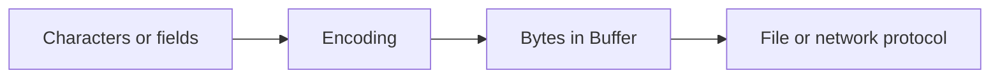

# Buffers, Binary Data and Encoding

## Concept

A Buffer is a byte-oriented view used for files, sockets, cryptography, compression, and binary protocols; text encodings map between bytes and characters.

## Why It Exists

Encoding mistakes corrupt data, break signatures, expose stale memory, or let attackers bypass validation.

## Mental Model



Treat every arrow as a boundary with a cost, ownership rule, cancellation behavior, and failure mode. Node.js is effective when those boundaries are explicit instead of hidden behind framework defaults.

## How It Works

The JavaScript callback runs on the main JavaScript thread. Native Node.js bindings, libuv, the operating system, worker threads, child processes, or remote services may perform work elsewhere. Completion only becomes useful when control returns to JavaScript. Under load, the important questions are what is queued, what is bounded, what can be cancelled, and which resource saturates first.

## Example

```js
const text = 'Node ✓';
const bytes = Buffer.from(text, 'utf8');
console.log({bytes, hex: bytes.toString('hex'), base64: bytes.toString('base64')});
console.log(bytes.readUInt8(0));
console.log(bytes.toString('utf8'));
```

The example is intentionally small enough to execute, but the production boundary is the important part: validate inputs, establish a deadline, propagate cancellation, classify failures, and release resources deterministically.

## Production Use

Define encodings at boundaries, validate declared lengths, use typed reads for binary protocols, and stream large payloads.

## Security

Use safe allocation, cap lengths, avoid leaking uninitialized bytes, validate MIME by content where required, and use constant-time comparison for secrets.

## Performance

Buffer slices can share memory. Large retained slices can retain larger backing stores. Track external memory separately from V8 heap.

## Common Mistakes

- Assuming string length equals byte length.
- Mutating a shared slice unexpectedly.
- Converting huge binary payloads to base64 in memory.

## Debugging

Log lengths and encodings, compare byte-level fixtures, inspect external memory, and reproduce at chunk boundaries.

## Testing

Test multibyte Unicode split across chunks, endian variants, truncated frames, oversized lengths, and round trips.

## When Not to Use It

Do not use Buffer where ordinary typed domain values are clearer and no binary boundary exists.

## Interview Questions

- How are Buffer and Uint8Array related?
- What is endianness?
- Why can a small slice retain a large allocation?

## Official References

- [nodejs.org](https://nodejs.org/api/)
- [nodejs.org](https://nodejs.org/en/about/previous-releases)
