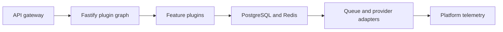

# Capstone 3 — Fastify API Platform

## Requirements

Create a multi-team API platform using Fastify plugins, encapsulation, JSON Schema, typed contracts, structured logs, tenant context and reusable platform capabilities.

The system must expose documented interfaces, enforce tenant and object-level authorization, validate all external data, propagate request and job identifiers, use bounded resources, support graceful shutdown, and retain enough evidence to recover from partial failure.

## Architecture



### Components

- `API gateway`
- `Fastify plugin graph`
- `Feature plugins`
- `PostgreSQL and Redis`
- `Queue and provider adapters`
- `Platform telemetry`

## Directory Structure

```text
src/
  app/
    bootstrap.ts
    config.ts
  modules/
    domain/
    application/
    adapters/
    transport/
  platform/
    database/
    cache/
    queue/
    telemetry/
  tests/
    unit/
    integration/
    contract/
    e2e/
```

The directory names are examples, not a universal rule. The important contract is dependency direction: transport calls application use cases; application code depends on ports; infrastructure implements those ports; domain rules do not import the HTTP framework or provider SDK.

## Runtime Boundaries

The HTTP or message handler runs JavaScript on the main thread. Network and database operations wait asynchronously. Validation, JSON parsing, serialization, policy evaluation, and domain computation run on the main JavaScript thread. CPU-heavy work must use a bounded worker pool or external service. Every remote call receives a deadline and AbortSignal where supported.

## Database Design

Give each feature plugin owned tables or schemas, migration ownership and repository interfaces. Add an outbox and tenant-aware indexes.

Use migrations, constraints, indexes driven by query patterns, bounded connection pools, explicit transaction boundaries, and an outbox when a committed business change must cause a reliable asynchronous side effect.

## API Design

Standardize route schemas, response serialization, error types, request IDs, pagination and plugin health contracts while keeping feature APIs independently testable.

Use Problem Details-compatible errors, request and correlation IDs, documented pagination, stable error codes, size limits, OpenAPI or equivalent contracts, and idempotency for retryable writes.

## Authentication

Provide an authentication plugin that verifies OIDC/JWT/session credentials and exposes a minimal principal; feature plugins enforce resource policy.

Authentication establishes the principal. Never accept identity, tenant, role, price, entitlement, or ownership merely because a client sent it.

## Authorization

Perform role or permission checks plus resource and tenant checks inside the owning use case. Background jobs and webhooks must carry or reconstruct an authorized system context rather than bypassing policy.

## Validation

Validate HTTP parameters, bodies, files, provider responses, queue messages, database-decoded JSON, configuration, and environment variables. Convert unknown input into domain-specific values before business logic.

## Error Handling

Classify validation, authentication, authorization, conflict, not-found, rate-limit, timeout, transient dependency, and programmer errors. Return safe public errors, preserve internal causes, retry only safe transient failures, and terminate the process when an unknown programmer error leaves state untrustworthy.

## Caching

Offer an opt-in cache plugin with namespaced keys, coalescing and metrics rather than hidden global caching.

Cache keys must include every dimension that changes visibility or value, including tenant and user scope where relevant. Define TTL, invalidation, stampede protection, stale policy, and cache-outage behavior.

## Background Jobs

Provide a queue plugin for durable jobs, retries, scheduling and dead letters with feature-owned job handlers.

Consumers are idempotent, use bounded concurrency, record attempts, propagate correlation identifiers, acknowledge only after the durable success boundary, and move poison work to a dead-letter or operator workflow.

## Security

Threat-model injection, SSRF, traversal, prototype pollution, mass assignment, broken object authorization, secret leakage, replay, unsafe uploads, dependency compromise, and denial of service. Use least-privilege database, broker, storage, and provider credentials. Redact logs and protect diagnostic artifacts.

## Testing

- unit tests for domain policies and deterministic transformations;
- integration tests against real database, cache, queue, and storage behavior;
- API or message-contract tests for validation, authorization and errors;
- end-to-end tests for critical user journeys;
- duplicate, timeout, cancellation, crash and recovery tests;
- load and soak tests with representative data and dependency latency;
- security tests for negative authorization and malicious input.

## Deployment

Build an immutable artifact on Node.js 24 LTS, run as a non-root process, expose readiness and liveness, handle SIGTERM, stop new work, drain requests and consumers, close pools, and exit within a defined budget. Use expand-contract migrations, canary or rolling rollout, smoke tests, backups and rollback.

## Observability

Emit structured logs, RED metrics, pool and queue saturation, event-loop delay, memory, provider and database latency, business outcome counters, and distributed traces. Define SLOs for the critical journey and alert on user impact rather than every internal fluctuation.

## Failure Scenarios

- plugin initialization fails
- schema drift between teams
- decorator collision
- tenant context leak
- logger exporter outage
- queue backlog
- plugin upgrade breaks response contract

For every scenario, state detection, timeout, retry or no-retry decision, idempotency boundary, degraded behavior, operator action, and recovery verification.

## Scaling Strategy

Scale stateless instances, isolate noisy plugins by quotas, split only proven hotspots, publish internal packages with compatibility tests and governance.

Scale only after measuring the first constrained resource. Include database and provider capacity, not only Node replicas.

## Extensions

- Add contract-driven SDK generation
- Add plugin compatibility matrix
- Add per-feature SLO dashboards

## Design Review Questions

- Which invariant must be atomic?
- Where can duplicate execution occur?
- What blocks the main JavaScript thread?
- Which resource saturates first under ten times the load?
- How is tenant isolation enforced at every storage and messaging boundary?
- How does the system recover after a crash between state change and side effect?
