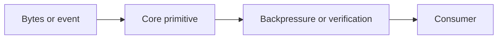

# Core APIs: Events, Buffers, Streams and Crypto

## Concept

Events coordinate in-process notifications, Buffers model bytes, Streams move data with backpressure, and Crypto provides cryptographic primitives.

## Why It Exists

These modules underpin HTTP, files, compression, protocols, uploads, signing, and many framework abstractions.

## Mental Model



Treat every arrow as a boundary with a cost, ownership rule, cancellation behavior, and failure mode. Node.js is effective when those boundaries are explicit instead of hidden behind framework defaults.

## How It Works

The JavaScript callback runs on the main JavaScript thread. Native Node.js bindings, libuv, the operating system, worker threads, child processes, or remote services may perform work elsewhere. Completion only becomes useful when control returns to JavaScript. Under load, the important questions are what is queued, what is bounded, what can be cancelled, and which resource saturates first.

## Example

```js
import { createHash } from 'node:crypto';
import { createReadStream } from 'node:fs';

const hash = createHash('sha256');
for await (const chunk of createReadStream(new URL(import.meta.url))) {
  hash.update(chunk);
}
console.log(hash.digest('hex'));
```

The example is intentionally small enough to execute, but the production boundary is the important part: validate inputs, establish a deadline, propagate cancellation, classify failures, and release resources deterministically.

## Production Use

Use `pipeline` for stream composition, explicit error listeners for emitters, safe buffer allocation, and vetted high-level cryptographic designs.

## Security

Never use plain hashes for passwords, compare signatures safely, avoid nonce/key reuse, and cap untrusted stream sizes.

## Performance

Streaming keeps memory bounded, but high-water marks and slow consumers still matter. Cryptography and encoding can consume CPU or thread-pool capacity.

## Common Mistakes

- Ignoring the EventEmitter `error` event.
- Using `Buffer.allocUnsafe` without overwriting every byte.
- Inventing an encryption protocol.

## Debugging

Trace stream lifecycle, bytes, backpressure, error propagation, and hash/signature inputs.

## Testing

Test chunk boundaries, early errors, slow consumers, cancellation, malformed encodings, and known cryptographic vectors.

## When Not to Use It

Do not use in-process events for durable cross-service delivery.

## Interview Questions

- How does stream backpressure work?
- Why are bytes not characters?
- What is the difference between hashing and encryption?

## Official References

- [nodejs.org](https://nodejs.org/api/)
- [nodejs.org](https://nodejs.org/en/about/previous-releases)
