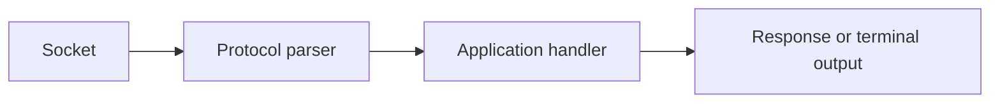

# Core APIs: HTTP, Networking, Compression and Readline

## Concept

Node core provides low-level HTTP, TLS, TCP, UDP, DNS, compression, and terminal primitives.

## Why It Exists

Framework users still need these concepts to configure timeouts, connection reuse, body limits, protocol behavior, and graceful shutdown.

## Mental Model



Treat every arrow as a boundary with a cost, ownership rule, cancellation behavior, and failure mode. Node.js is effective when those boundaries are explicit instead of hidden behind framework defaults.

## How It Works

The JavaScript callback runs on the main JavaScript thread. Native Node.js bindings, libuv, the operating system, worker threads, child processes, or remote services may perform work elsewhere. Completion only becomes useful when control returns to JavaScript. Under load, the important questions are what is queued, what is bounded, what can be cancelled, and which resource saturates first.

## Example

```js
import { createServer } from 'node:http';

const server = createServer((request, response) => {
  if (request.method === 'GET' && request.url === '/health') {
    response.writeHead(200, {'content-type': 'application/json'});
    response.end(JSON.stringify({status: 'ok'}));
    return;
  }
  response.writeHead(404).end();
});
server.requestTimeout = 15_000;
server.headersTimeout = 10_000;
server.listen(3000);
```

The example is intentionally small enough to execute, but the production boundary is the important part: validate inputs, establish a deadline, propagate cancellation, classify failures, and release resources deterministically.

## Production Use

Set server and client deadlines, stream bodies, configure keep-alive deliberately, and understand proxy/TLS ownership.

## Security

Reject oversized or slow bodies, validate host/proxy headers, prevent SSRF, and never decompress unbounded attacker-controlled data.

## Performance

Connection pools, compression, serialization, and slow clients affect memory and tail latency. Measure sockets and bytes, not only request count.

## Common Mistakes

- Using default timeouts without threat modeling.
- Buffering every request body.
- Treating a TCP data event as one application message.

## Debugging

Inspect socket states, DNS timing, TLS handshakes, HTTP headers, compression ratios, and active connections.

## Testing

Test slow clients, partial frames, aborts, timeouts, malformed headers, compression bombs, and graceful connection draining.

## When Not to Use It

Do not implement an application protocol directly over TCP unless framing, retries, security, observability, and compatibility justify it.

## Interview Questions

- Why is TCP a byte stream rather than a message protocol?
- Which HTTP timeouts should a server set?
- How does keep-alive affect capacity?

## Official References

- [nodejs.org](https://nodejs.org/api/)
- [nodejs.org](https://nodejs.org/en/about/previous-releases)
