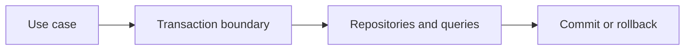

# Data Access Patterns and Transaction Boundaries

## Concept

Drivers, query builders, ORMs, repositories, units of work, and services are tools for expressing data ownership and transaction boundaries.

## Why It Exists

Abstractions fail when they hide query shape, connection lifecycle, or the invariant that must commit atomically.

## Mental Model



Treat every arrow as a boundary with a cost, ownership rule, cancellation behavior, and failure mode. Node.js is effective when those boundaries are explicit instead of hidden behind framework defaults.

## How It Works

The JavaScript callback runs on the main JavaScript thread. Native Node.js bindings, libuv, the operating system, worker threads, child processes, or remote services may perform work elsewhere. Completion only becomes useful when control returns to JavaScript. Under load, the important questions are what is queued, what is bounded, what can be cancelled, and which resource saturates first.

## Example

```ts
type Transaction = {
  query(sql: string, values?: readonly unknown[]): Promise<unknown>;
};

async function transfer(tx: Transaction, from: string, to: string, amount: number) {
  await tx.query('update accounts set balance = balance - $1 where id = $2', [amount, from]);
  await tx.query('update accounts set balance = balance + $1 where id = $2', [amount, to]);
  await tx.query('insert into transfer_events(source, destination, amount) values ($1,$2,$3)', [from, to, amount]);
}
```

The example is intentionally small enough to execute, but the production boundary is the important part: validate inputs, establish a deadline, propagate cancellation, classify failures, and release resources deterministically.

## Production Use

Keep transactions at application-use-case boundaries, use constraints as final guards, expose deliberate query methods, and adopt an outbox for reliable side effects.

## Security

Prevent injection, mass assignment, tenant leaks, over-broad database roles, and sensitive query logging.

## Performance

Avoid N+1, long transactions, accidental full scans, pool starvation, and loading unbounded graphs through an ORM.

## Common Mistakes

- Putting a transaction inside every repository method.
- Mocking the ORM and never testing real SQL.
- Returning lazy ORM objects outside a transaction.

## Debugging

Log transaction IDs safely, pool wait, query fingerprints, rows, lock waits, and rollback causes.

## Testing

Test real constraints, isolation anomalies, deadlocks, retries, migrations, and concurrent operations.

## When Not to Use It

Do not add a repository layer that merely renames every ORM method without protecting a boundary.

## Interview Questions

- Where should transaction boundaries live?
- What is the N+1 problem?
- ORM vs raw SQL: how do you decide?

## Official References

- [nodejs.org](https://nodejs.org/api/)
- [nodejs.org](https://nodejs.org/en/about/previous-releases)
