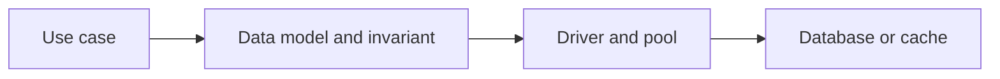

# PostgreSQL, MongoDB and Redis

## Concept

Node applications commonly combine a relational system, document store, or in-memory data structure server based on invariants and access patterns.

## Why It Exists

Choosing and operating data stores requires understanding connections, pooling, transactions, indexing, consistency, and failure rather than ORM syntax.

## Mental Model



Treat every arrow as a boundary with a cost, ownership rule, cancellation behavior, and failure mode. Node.js is effective when those boundaries are explicit instead of hidden behind framework defaults.

## How It Works

The JavaScript callback runs on the main JavaScript thread. Native Node.js bindings, libuv, the operating system, worker threads, child processes, or remote services may perform work elsewhere. Completion only becomes useful when control returns to JavaScript. Under load, the important questions are what is queued, what is bounded, what can be cancelled, and which resource saturates first.

## Example

```ts
type Queryable = {
  query<T>(sql: string, values: readonly unknown[]): Promise<{rows: T[]}>;
};

async function findOrder(db: Queryable, id: string) {
  const result = await db.query<{id: string; status: string}>(
    'select id, status from orders where id = $1',
    [id],
  );
  return result.rows[0] ?? null;
}
```

The example is intentionally small enough to execute, but the production boundary is the important part: validate inputs, establish a deadline, propagate cancellation, classify failures, and release resources deterministically.

## Production Use

Use PostgreSQL for relational invariants and transactions, MongoDB for document models aligned with aggregate access, and Redis for bounded ephemeral data structures, caches, rate limits, and coordination with explicit failure semantics.

## Security

Parameterize queries, enforce tenant predicates and database constraints, secure connections, rotate credentials, and never trust cached authorization indefinitely.

## Performance

Pool size, query plans, indexes, lock waits, document shape, Redis memory, TTLs, and network round trips determine performance.

## Common Mistakes

- One connection per request.
- Using Redis as a durable source of truth without durability design.
- Adding indexes without measuring write and storage cost.

## Debugging

Capture pool wait, query duration, plans, lock/deadlock events, cache hit rate, eviction, and connection errors.

## Testing

Use real databases in integration tests for transactions, constraints, indexes, failover, and serialization behavior.

## When Not to Use It

Do not use multiple databases when one system satisfies the requirements and operational simplicity is more valuable.

## Interview Questions

- How do you size a connection pool?
- When would you choose a document model?
- What happens when Redis is unavailable?

## Official References

- [www.postgresql.org](https://www.postgresql.org/docs/)
- [www.mongodb.com](https://www.mongodb.com/docs/)
- [redis.io](https://redis.io/docs/latest/)
