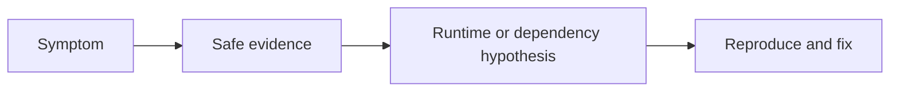

# Debugging and Diagnostics

## Concept

Node diagnostics include the inspector, breakpoints, source maps, CPU profiles, heap snapshots, diagnostic reports, async context, event-loop metrics, and structured reproduction.

## Why It Exists

Production incidents require evidence that distinguishes CPU, memory, GC, event loop, pools, network, database, and downstream failure.

## Mental Model



Treat every arrow as a boundary with a cost, ownership rule, cancellation behavior, and failure mode. Node.js is effective when those boundaries are explicit instead of hidden behind framework defaults.

## How It Works

The JavaScript callback runs on the main JavaScript thread. Native Node.js bindings, libuv, the operating system, worker threads, child processes, or remote services may perform work elsewhere. Completion only becomes useful when control returns to JavaScript. Under load, the important questions are what is queued, what is bounded, what can be cancelled, and which resource saturates first.

## Example

```js
import { monitorEventLoopDelay } from 'node:perf_hooks';
import process from 'node:process';

const delay = monitorEventLoopDelay({resolution: 20});
delay.enable();

setInterval(() => {
  console.log({
    rss: process.memoryUsage().rss,
    heapUsed: process.memoryUsage().heapUsed,
    eventLoopP99Ms: Number(delay.percentile(99)) / 1e6,
  });
  delay.reset();
}, 10_000).unref();
```

The example is intentionally small enough to execute, but the production boundary is the important part: validate inputs, establish a deadline, propagate cancellation, classify failures, and release resources deterministically.

## Production Use

Keep source maps accessible to trusted tooling, enable diagnostic reports, retain deploy/version metadata, and establish profiling/runbook procedures before incidents.

## Security

Heap snapshots and reports may contain secrets or user data. Restrict storage and access, redact logs, and avoid exposing inspector ports.

## Performance

Profiling has overhead. Sample deliberately, reproduce under representative load, and compare before/after measurements.

## Common Mistakes

- Taking a heap snapshot on an already memory-starved process without planning.
- Leaving the inspector publicly reachable.
- Using console logs without request context.

## Debugging

Start with symptom and timeline, compare golden signals, then choose CPU, heap, report, network, database, or trace evidence.

## Testing

Create regression tests from the production failure, including the triggering concurrency and dependency conditions.

## When Not to Use It

Do not debug by adding broad sensitive logging to production.

## Interview Questions

- Heap snapshot vs CPU profile?
- How do you diagnose open handles?
- How do you distinguish event-loop delay from slow dependencies?

## Official References

- [nodejs.org](https://nodejs.org/api/)
- [nodejs.org](https://nodejs.org/en/about/previous-releases)
