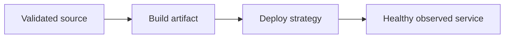

# Deployment and Production Operations

## Concept

Production deployment packages an immutable Node artifact, configures a supervised Linux process or container, handles signals, exposes health, runs migrations safely, and rolls out with rollback.

## Why It Exists

The same code can fail operationally through incorrect images, signals, probes, permissions, migrations, or deployment sequencing.

## Mental Model



Treat every arrow as a boundary with a cost, ownership rule, cancellation behavior, and failure mode. Node.js is effective when those boundaries are explicit instead of hidden behind framework defaults.

## How It Works

The JavaScript callback runs on the main JavaScript thread. Native Node.js bindings, libuv, the operating system, worker threads, child processes, or remote services may perform work elsewhere. Completion only becomes useful when control returns to JavaScript. Under load, the important questions are what is queued, what is bounded, what can be cancelled, and which resource saturates first.

## Example

```dockerfile
FROM node:24-bookworm-slim AS deps
WORKDIR /app
COPY package*.json ./
RUN npm ci --omit=dev --ignore-scripts

FROM node:24-bookworm-slim
ENV NODE_ENV=production
WORKDIR /app
USER node
COPY --chown=node:node --from=deps /app/node_modules ./node_modules
COPY --chown=node:node dist ./dist
CMD ["node", "dist/server.js"]
```

The example is intentionally small enough to execute, but the production boundary is the important part: validate inputs, establish a deadline, propagate cancellation, classify failures, and release resources deterministically.

## Production Use

Use supported Node LTS, non-root images, immutable artifacts, readiness/liveness, graceful draining, rolling/blue-green/canary releases, migration gates, smoke tests, backups, and runbooks.

## Security

Scan and sign images, minimize packages and privileges, protect CI credentials, pin trusted actions, and separate build from deployment identities.

## Performance

Use multi-stage builds and dependency caching, but verify cold start, memory limit, startup CPU, connection draining, and replica capacity.

## Common Mistakes

- Running migrations independently on every replica without coordination.
- Using latest image tags.
- Assuming SIGTERM reaches Node through a shell wrapper.

## Debugging

Record artifact digest, commit, runtime, configuration version, deployment events, probe state, and rollback reason.

## Testing

Test the built image, signals, read-only filesystems, dependency outage, migration compatibility, rolling overlap, and rollback.

## When Not to Use It

Do not use PM2 inside Kubernetes unless a measured multi-process requirement justifies the extra supervisor layer.

## Interview Questions

- How does graceful shutdown work in a container?
- Rolling vs blue-green vs canary?
- How do you deploy a breaking database change safely?

## Official References

- [nodejs.org](https://nodejs.org/api/)
- [nodejs.org](https://nodejs.org/en/about/previous-releases)
