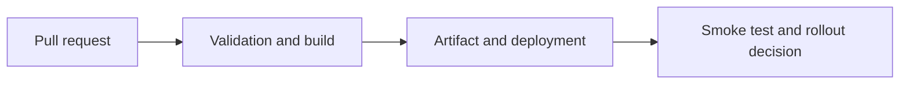

# Docker, Kubernetes and CI/CD

## Concept

Containers package runtime dependencies; Kubernetes schedules and replaces workloads; CI/CD validates, builds, attests, deploys, and verifies artifacts.

## Why It Exists

A reliable pipeline enforces the same contracts on every change and preserves traceability from source to production.

## Mental Model



Treat every arrow as a boundary with a cost, ownership rule, cancellation behavior, and failure mode. Node.js is effective when those boundaries are explicit instead of hidden behind framework defaults.

## How It Works

The JavaScript callback runs on the main JavaScript thread. Native Node.js bindings, libuv, the operating system, worker threads, child processes, or remote services may perform work elsewhere. Completion only becomes useful when control returns to JavaScript. Under load, the important questions are what is queued, what is bounded, what can be cancelled, and which resource saturates first.

## Example

```yaml
name: node-service
on:
  pull_request:
  push:
    branches: [main]
jobs:
  validate:
    runs-on: ubuntu-latest
    steps:
      - uses: actions/checkout@v4
      - uses: actions/setup-node@v4
        with:
          node-version: 24
          cache: npm
      - run: npm ci --no-audit --no-fund
      - run: npm test
      - run: npm run build
```

The example is intentionally small enough to execute, but the production boundary is the important part: validate inputs, establish a deadline, propagate cancellation, classify failures, and release resources deterministically.

## Production Use

Use reproducible builds, artifact promotion, least-privilege identities, environment protection, rollout observation, automated rollback criteria, and production smoke tests.

## Security

Pin actions and images, guard secrets, prevent untrusted pull requests from receiving deployment tokens, and enforce image/runtime security.

## Performance

Cache dependencies safely, parallelize independent checks, right-size requests/limits, and avoid probe or autoscaling feedback loops.

## Common Mistakes

- Building again separately in each environment.
- Deploying from a developer laptop.
- Using CPU autoscaling without queue or latency signals for I/O workloads.

## Debugging

Follow run IDs, artifact digests, Kubernetes events, pod termination, probe failures, and rollout history.

## Testing

Use ephemeral environments where useful, test manifests and policies, and rehearse rollback and disaster recovery.

## When Not to Use It

Do not adopt Kubernetes when platform complexity exceeds the service fleet's needs and a managed simpler runtime suffices.

## Interview Questions

- What should be immutable between staging and production?
- How do resource limits affect Node memory?
- What makes a CI pipeline supply-chain safe?

## Official References

- [nodejs.org](https://nodejs.org/api/)
- [nodejs.org](https://nodejs.org/en/about/previous-releases)
