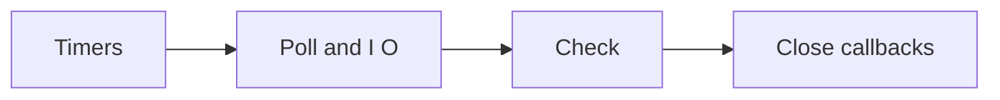

# Event Loop Phases

## Concept

The event loop advances eligible work through timers, pending callbacks, poll, check, and close-callback phases while JavaScript callbacks still run to completion.

## Why It Exists

Understanding phases prevents false ordering guarantees and helps diagnose starvation, delayed timers, and poor tail latency.

## Mental Model



Treat every arrow as a boundary with a cost, ownership rule, cancellation behavior, and failure mode. Node.js is effective when those boundaries are explicit instead of hidden behind framework defaults.

## How It Works

The JavaScript callback runs on the main JavaScript thread. Native Node.js bindings, libuv, the operating system, worker threads, child processes, or remote services may perform work elsewhere. Completion only becomes useful when control returns to JavaScript. Under load, the important questions are what is queued, what is bounded, what can be cancelled, and which resource saturates first.

## Example

```js
import { readFile } from 'node:fs';

setTimeout(() => console.log('timer'), 0);
setImmediate(() => console.log('immediate'));

readFile(import.meta.filename, () => {
  setTimeout(() => console.log('I/O timer'), 0);
  setImmediate(() => console.log('I/O immediate'));
});
```

The example is intentionally small enough to execute, but the production boundary is the important part: validate inputs, establish a deadline, propagate cancellation, classify failures, and release resources deterministically.

## Production Use

Use phase knowledge to explain observations, not to encode business invariants around incidental callback ordering.

## Security

Starvation can become a denial-of-service vector. Bound synchronous work and untrusted regular expressions, payload sizes, and callback recursion.

## Performance

Each long callback delays every ready callback in that process. Measure event-loop delay and utilization together with CPU and dependency latency.

## Common Mistakes

- Expecting `setTimeout(fn, 0)` to run immediately.
- Memorizing one top-level ordering as universal.
- Blaming the event loop for downstream latency without measurement.

## Debugging

Capture event-loop delay, CPU profiles, callback duration, active handles, and an async trace around the slow request.

## Testing

Test only documented ordering; use barriers or Promises when application correctness requires sequence.

## When Not to Use It

Do not use phase-specific scheduling as a replacement for a queue, state machine, or explicit synchronization.

## Interview Questions

- What happens in the poll phase?
- Why can `setImmediate` run before a zero-delay timer after I/O?
- How do you prove event-loop starvation?

## Official References

- [nodejs.org](https://nodejs.org/en/learn/asynchronous-work/event-loop-timers-and-nexttick)
- [docs.libuv.org](https://docs.libuv.org/en/v1.x/design.html)
