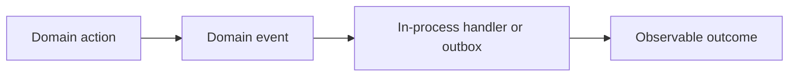

# EventEmitter and Event-Driven Design

## Concept

EventEmitter coordinates synchronous in-process notifications; domain and integration events model facts with different durability and ownership requirements.

## Why It Exists

Conflating in-memory events with durable messaging causes lost work, hidden coupling, and unclear failure handling.

## Mental Model



Treat every arrow as a boundary with a cost, ownership rule, cancellation behavior, and failure mode. Node.js is effective when those boundaries are explicit instead of hidden behind framework defaults.

## How It Works

The JavaScript callback runs on the main JavaScript thread. Native Node.js bindings, libuv, the operating system, worker threads, child processes, or remote services may perform work elsewhere. Completion only becomes useful when control returns to JavaScript. Under load, the important questions are what is queued, what is bounded, what can be cancelled, and which resource saturates first.

## Example

```ts
import { EventEmitter } from 'node:events';

type Events = {
  'order.created': [{orderId: string}];
};

class TypedBus extends EventEmitter {
  emit<K extends keyof Events>(event: K, ...args: Events[K]): boolean {
    return super.emit(event, ...args);
  }
}

const bus = new TypedBus();
bus.on('order.created', ({orderId}) => console.log({orderId}));
bus.emit('order.created', {orderId: 'ord_123'});
```

The example is intentionally small enough to execute, but the production boundary is the important part: validate inputs, establish a deadline, propagate cancellation, classify failures, and release resources deterministically.

## Production Use

Use EventEmitter for local lifecycle or extension hooks. Use an outbox and broker when delivery must survive process failure or cross service boundaries.

## Security

Treat event payloads as data contracts; avoid secrets and enforce authorization before producing externally visible effects.

## Performance

Listeners execute synchronously by default. Slow handlers delay the emitter, and accumulating listeners can leak memory.

## Common Mistakes

- Using EventEmitter as a durable queue.
- Ignoring the special `error` event.
- Publishing mutable internal objects that listeners can corrupt.

## Debugging

Inspect listener counts, execution duration, handler failures, event version, and outbox/broker delivery state.

## Testing

Test listener order only when documented, handler idempotency, replay, duplicate delivery, and error paths.

## When Not to Use It

Do not use events when a direct function call better expresses required sequencing and failure propagation.

## Interview Questions

- Are EventEmitter listeners synchronous?
- What is the difference between a domain event and an integration event?
- Why must integration handlers be idempotent?

## Official References

- [nodejs.org](https://nodejs.org/api/)
- [nodejs.org](https://nodejs.org/en/about/previous-releases)
