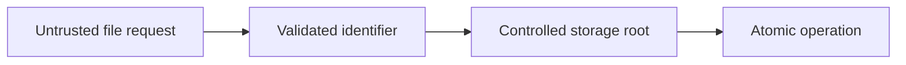

# Secure Filesystem and File Processing

## Concept

Filesystem code must handle paths, permissions, descriptors, races, symlinks, atomic writes, temporary files, uploads, cleanup, and platform differences.

## Why It Exists

Files are durable external state and a common source of traversal, overwrite, TOCTOU, and resource-exhaustion vulnerabilities.

## Mental Model



Treat every arrow as a boundary with a cost, ownership rule, cancellation behavior, and failure mode. Node.js is effective when those boundaries are explicit instead of hidden behind framework defaults.

## How It Works

The JavaScript callback runs on the main JavaScript thread. Native Node.js bindings, libuv, the operating system, worker threads, child processes, or remote services may perform work elsewhere. Completion only becomes useful when control returns to JavaScript. Under load, the important questions are what is queued, what is bounded, what can be cancelled, and which resource saturates first.

## Example

```js
import { open, rename } from 'node:fs/promises';
import { join } from 'node:path';
import { randomUUID } from 'node:crypto';

async function atomicWrite(root, name, content) {
  if (!/^[a-zA-Z0-9._-]+$/.test(name)) throw new Error('invalid file name');
  const temporary = join(root, `.${randomUUID()}.tmp`);
  const destination = join(root, name);
  const handle = await open(temporary, 'wx', 0o600);
  try {
    await handle.writeFile(content);
    await handle.sync();
  } finally {
    await handle.close();
  }
  await rename(temporary, destination);
}
```

The example is intentionally small enough to execute, but the production boundary is the important part: validate inputs, establish a deadline, propagate cancellation, classify failures, and release resources deterministically.

## Production Use

Use object storage for shared durable uploads, content-addressed or generated names, atomic replacement, background cleanup, and malware-scanning workflows.

## Security

Never trust an upload filename or MIME header. Prevent traversal, symlink following where inappropriate, unsafe permissions, decompression bombs, and public serving before scanning.

## Performance

Stream large files, bound concurrency, avoid recursive scans in request paths, and understand local-disk behavior in containers.

## Common Mistakes

- Checking a path and then using it later as if it cannot change.
- Using predictable temporary names.
- Serving an upload from the same origin before validation.

## Debugging

Inspect normalized paths, inode/descriptor metadata, permissions, open handles, disk usage, and race timing.

## Testing

Test traversal variants, symlinks, existing destinations, partial writes, full disk, permission failures, aborts, and cleanup.

## When Not to Use It

Do not use ad hoc file locking as a distributed coordination mechanism across hosts.

## Interview Questions

- What is a TOCTOU vulnerability?
- How does an atomic write work?
- Why validate file content instead of trusting MIME headers?

## Official References

- [nodejs.org](https://nodejs.org/api/)
- [nodejs.org](https://nodejs.org/en/about/previous-releases)
