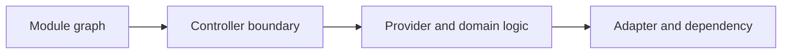

# Production NestJS Guide

## Concept

NestJS layers modules, controllers, providers, dependency injection, pipes, guards, interceptors, filters, and platform adapters over Node frameworks.

## Why It Exists

It provides consistent enterprise conventions, but those conventions must not hide runtime, transport, and lifecycle costs.

## Mental Model



Treat every arrow as a boundary with a cost, ownership rule, cancellation behavior, and failure mode. Node.js is effective when those boundaries are explicit instead of hidden behind framework defaults.

## How It Works

The JavaScript callback runs on the main JavaScript thread. Native Node.js bindings, libuv, the operating system, worker threads, child processes, or remote services may perform work elsewhere. Completion only becomes useful when control returns to JavaScript. Under load, the important questions are what is queued, what is bounded, what can be cancelled, and which resource saturates first.

## Example

```ts
import {Controller, Get, Injectable, Module} from '@nestjs/common';

@Injectable()
class HealthService {
  read() { return {status: 'ok'} as const; }
}
@Controller('health')
class HealthController {
  constructor(private readonly health: HealthService) {}
  @Get() read() { return this.health.read(); }
}
@Module({controllers: [HealthController], providers: [HealthService]})
export class HealthModule {}
```

The example is intentionally small enough to execute, but the production boundary is the important part: validate inputs, establish a deadline, propagate cancellation, classify failures, and release resources deterministically.

## Production Use

Organize modules around capabilities, keep request scope rare, validate DTOs at ingress, centralize authorization policies, and understand the Express or Fastify adapter underneath.

## Security

Guards do not remove the need for object-level authorization. Avoid dynamic modules that leak secrets or privileged providers across tenants.

## Performance

Reflection, DI, decorators, and request-scoped providers add overhead. Measure startup, memory, and request paths before optimizing.

## Common Mistakes

- Creating a global shared module for every service.
- Using circular forward references as normal architecture.
- Putting domain rules in decorators or interceptors.

## Debugging

Inspect the module graph, provider scope, lifecycle hooks, adapter behavior, and generated stack traces.

## Testing

Use unit tests for providers, module integration tests, adapter HTTP tests, and lifecycle/shutdown tests.

## When Not to Use It

Do not use NestJS when a small service needs minimal abstraction and the team cannot support its architectural conventions.

## Interview Questions

- What is provider scope?
- Guard vs pipe vs interceptor?
- How do you prevent NestJS from hiding core Node behavior?

## Official References

- [docs.nestjs.com](https://docs.nestjs.com/)
