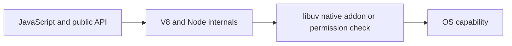

# V8, libuv, Node-API and Permission Model

## Concept

Advanced Node internals include V8 compilation and garbage collection, libuv handles and requests, native addons through Node-API, module hooks, snapshots, and process permissions.

## Why It Exists

Senior engineers should distinguish stable public contracts from useful but changeable implementation details.

## Mental Model



Treat every arrow as a boundary with a cost, ownership rule, cancellation behavior, and failure mode. Node.js is effective when those boundaries are explicit instead of hidden behind framework defaults.

## How It Works

The JavaScript callback runs on the main JavaScript thread. Native Node.js bindings, libuv, the operating system, worker threads, child processes, or remote services may perform work elsewhere. Completion only becomes useful when control returns to JavaScript. Under load, the important questions are what is queued, what is bounded, what can be cancelled, and which resource saturates first.

## Example

```js
import process from 'node:process';

console.log({
  node: process.version,
  v8: process.versions.v8,
  napi: process.versions.napi,
  permissionApiAvailable: typeof process.permission === 'object',
});
```

The example is intentionally small enough to execute, but the production boundary is the important part: validate inputs, establish a deadline, propagate cancellation, classify failures, and release resources deterministically.

## Production Use

Use public diagnostics before internal flags, Node-API for ABI-stable native addons, permissions to restrict trusted applications, and version-gated feature detection.

## Security

Native addons can violate memory safety; permissions are not a hostile-code sandbox; VM contexts and loader hooks do not isolate attackers.

## Performance

Hidden classes, inline caches, JIT, deoptimization, GC, native crossings, startup snapshots, and addon calls can matter after profiling identifies a hotspot.

## Common Mistakes

- Coding around a V8 optimization rumor.
- Using C++ addons before exhausting safe alternatives.
- Claiming the Permission Model replaces containers or OS controls.

## Debugging

Capture Node/V8 versions, CPU/heap profiles, deoptimization evidence only when needed, addon crash data, and permission denial codes.

## Testing

Run supported-version matrices, permission tests, native ABI/platform builds, memory safety tooling, and fallback paths.

## When Not to Use It

Do not rely on undocumented V8 object layout or internal Node modules as application contracts.

## Interview Questions

- What is Node-API?
- What can the Permission Model restrict?
- Why can V8 optimization details change?

## Official References

- [nodejs.org](https://nodejs.org/api/n-api.html)
- [nodejs.org](https://nodejs.org/api/permissions.html)
- [v8.dev](https://v8.dev/docs)
- [docs.libuv.org](https://docs.libuv.org/)
