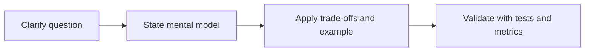

# Node.js Interview Mastery

## Concept

Strong Node interviews explain mechanisms, trade-offs, evidence, failure handling, and production decisions rather than reciting API names.

## Why It Exists

Interview progression should cover runtime, async, streams, networking, data, security, testing, debugging, performance, architecture, incidents, and behavioral ownership.

## Mental Model



Treat every arrow as a boundary with a cost, ownership rule, cancellation behavior, and failure mode. Node.js is effective when those boundaries are explicit instead of hidden behind framework defaults.

## How It Works

The JavaScript callback runs on the main JavaScript thread. Native Node.js bindings, libuv, the operating system, worker threads, child processes, or remote services may perform work elsewhere. Completion only becomes useful when control returns to JavaScript. Under load, the important questions are what is queued, what is bounded, what can be cancelled, and which resource saturates first.

## Example

```ts
function answerFramework(topic: string): string[] {
  return [
    `Define ${topic}`,
    'Explain the runtime mechanism',
    'Give a production example',
    'Name failure and security risks',
    'Describe measurement and testing',
    'State when not to use it',
  ];
}
console.log(answerFramework('stream backpressure'));
```

The example is intentionally small enough to execute, but the production boundary is the important part: validate inputs, establish a deadline, propagate cancellation, classify failures, and release resources deterministically.

## Production Use

Practice 20-minute screens, 60-minute senior rounds, API design, debugging, performance investigation, system design, lead architecture, and production incidents.

## Security

Security answers should include threat boundaries and authorization, not only package names.

## Performance

Performance answers should start with a workload and metrics, then identify the constrained resource.

## Common Mistakes

- Saying Node is single-threaded and stopping.
- Claiming async/await makes CPU work non-blocking.
- Giving architecture without failure or migration strategy.

## Debugging

After each mock interview, classify weak answers by missing mechanism, example, trade-off, security, measurement, or communication.

## Testing

Time-box mocks, use scoring rubrics, write code, debug broken services, and defend designs under follow-up questions.

## When Not to Use It

Do not memorize one ideal answer; interviewers change constraints to test reasoning.

## Interview Questions

- Explain the event loop to a senior engineer.
- Design idempotent order creation.
- Diagnose rising p99 with low CPU.

## Official References

- [nodejs.org](https://nodejs.org/api/)
- [nodejs.org](https://nodejs.org/en/about/previous-releases)
