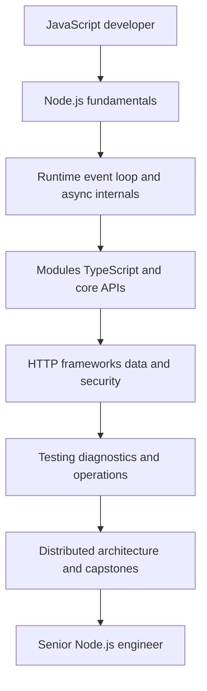
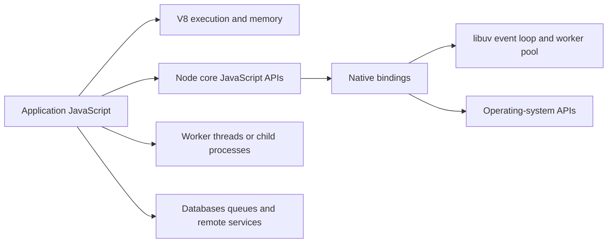

# Node.js Developer Handbook

This handbook teaches Node.js as a **runtime, backend engineering environment and production operating system for JavaScript applications**. Frameworks are introduced only after the Node.js execution, I/O, process, stream, networking and failure models are clear.

> **Research baseline — August 2, 2026:** Node.js **24.18.0 Krypton LTS** is the production baseline, Node.js **26.5.0** is the Current line, Node.js **22.23.1 Jod** is Maintenance LTS, npm **11.16.0** is bundled with the selected LTS release, and TypeScript **7.0.2** is the handbook compiler baseline. See [Current Node.js Release and Platform Baseline](./version-baseline.md).

## Learning Outcome



By the end, you should be able to:

- explain what V8, Node core, native bindings, libuv and the operating system each do;
- diagnose event-loop blocking, thread-pool saturation, memory retention and connection-pool pressure;
- design safe CommonJS, ESM, npm and TypeScript package boundaries;
- build streaming, cancellation-aware HTTP and background systems;
- choose Express, Fastify or NestJS from explicit constraints;
- model database transactions, caching, queues, idempotency and partial failure;
- implement authentication, authorization and Node-specific security controls;
- test behavior with real infrastructure and failure injection;
- deploy, observe, scale, migrate and recover Node.js services;
- defend architecture decisions in senior and staff interviews.

## Core Runtime Model



JavaScript callbacks normally run on one main JavaScript thread. The runtime is not therefore “single-threaded”: operating-system facilities, libuv workers, worker threads, child processes, native code and external systems can operate concurrently. Correct design identifies which layer is doing work, which resource is bounded, and where completion returns to JavaScript.

## How to Use the Handbook

1. Start with [Prerequisites and Runtime Mental Model](./00-start-here.md).
2. Follow the existing 75-chapter production path for broad progression.
3. Use the focused sections for exact mechanisms, production patterns and canonical routes.
4. Build the ten required capstone architectures.
5. Finish with the 320-question bank and mock interview rounds.
6. Revisit the version page before using experimental, release-candidate or platform-specific features.

## Status Legend

- ✅ stable or recommended for the stated baseline
- 🧪 experimental or version-sensitive
- ⚠️ deprecated, legacy or migration-only
- ⛔ intentionally excluded as a safe production recommendation

## Node.js Core First

The sequence is deliberate:

```text
runtime → event loop → modules → async → buffers → streams → files
→ HTTP and networking → frameworks → data → security → reliability
→ testing and diagnostics → deployment → distributed architecture
```

Express, Fastify and NestJS are valuable, but none replaces understanding sockets, request streams, timeouts, errors, cancellation, process lifecycle, memory and backpressure.

## Representative Focused Routes

- [Node.js Architecture](./runtime/nodejs-architecture.md)
- [Event Loop Phases](./event-loop/event-loop-phases.md)
- [CommonJS and ES Modules](./modules/commonjs-and-es-modules.md)
- [Promises and async/await](./async/promises-and-async-await.md)
- [Stream Backpressure](./streams/stream-backpressure.md)
- [HTTP Server with Node.js Core](./http/http-server.md)
- [Node.js Security Overview](./security/security-overview.md)
- [Testing Overview](./testing/testing-overview.md)
- [Performance Overview](./performance/performance-overview.md)
- [Deployment Overview](./deployment/deployment-overview.md)
- [Modular Monolith](./architecture/modular-monolith.md)
- [Production Express API Capstone](./capstones/production-api.md)
