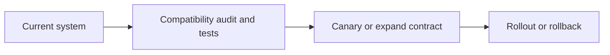

# Upgrades and Migrations

## Concept

Runtime, dependency, module-system, TypeScript, framework, database-driver, container, and architecture upgrades require compatibility evidence and safe rollout.

## Why It Exists

A Node major change can alter runtime semantics, native dependencies, deprecations, module resolution, diagnostics, and performance.

## Mental Model



Treat every arrow as a boundary with a cost, ownership rule, cancellation behavior, and failure mode. Node.js is effective when those boundaries are explicit instead of hidden behind framework defaults.

## How It Works

The JavaScript callback runs on the main JavaScript thread. Native Node.js bindings, libuv, the operating system, worker threads, child processes, or remote services may perform work elsewhere. Completion only becomes useful when control returns to JavaScript. Under load, the important questions are what is queued, what is bounded, what can be cancelled, and which resource saturates first.

## Example

```json
{
  "engines": {"node": ">=24 <25"},
  "scripts": {
    "test:runtime": "node --test",
    "test:deprecations": "node --trace-deprecation --test"
  }
}
```

The example is intentionally small enough to execute, but the production boundary is the important part: validate inputs, establish a deadline, propagate cancellation, classify failures, and release resources deterministically.

## Production Use

Read release notes, run old/new matrices, audit deprecations and native packages, use codemods, expand-contract database changes, canaries, and rollback.

## Security

Prioritize security updates, verify dependency provenance, protect migration credentials, and ensure old and new versions enforce the same authorization.

## Performance

Compare startup, memory, CPU, p95/p99, GC, event-loop delay, DB pools, and image size before and after.

## Common Mistakes

- Combining runtime, framework, ORM, and database upgrades in one unobservable release.
- Removing old schema before old instances are drained.
- Ignoring lockfile format and install behavior changes.

## Debugging

Record exact versions, flags, artifact digest, deprecation output, compatibility failures, and canary metrics.

## Testing

Run dual-version CI, contract tests, migration/rollback tests, native builds, and production-like canary traffic.

## When Not to Use It

Do not migrate CommonJS to ESM only for fashion when ecosystem and maintenance cost outweigh the benefit.

## Interview Questions

- How do you perform LTS-to-LTS migration?
- What is expand-contract?
- How do you canary a runtime upgrade?

## Official References

- [nodejs.org](https://nodejs.org/api/)
- [nodejs.org](https://nodejs.org/en/about/previous-releases)
