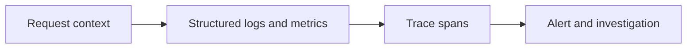

# Logging, Metrics and Tracing

## Concept

Logs describe events, metrics summarize behavior over time, and traces connect operations across asynchronous and distributed boundaries.

## Why It Exists

Together they answer what happened, how often, where time went, and which user-visible objective was affected.

## Mental Model



Treat every arrow as a boundary with a cost, ownership rule, cancellation behavior, and failure mode. Node.js is effective when those boundaries are explicit instead of hidden behind framework defaults.

## How It Works

The JavaScript callback runs on the main JavaScript thread. Native Node.js bindings, libuv, the operating system, worker threads, child processes, or remote services may perform work elsewhere. Completion only becomes useful when control returns to JavaScript. Under load, the important questions are what is queued, what is bounded, what can be cancelled, and which resource saturates first.

## Example

```ts
import { AsyncLocalStorage } from 'node:async_hooks';

const context = new AsyncLocalStorage<{requestId: string}>();

function log(event: string, fields: Record<string, unknown> = {}): void {
  console.log(JSON.stringify({
    time: new Date().toISOString(),
    event,
    requestId: context.getStore()?.requestId,
    ...fields,
  }));
}
```

The example is intentionally small enough to execute, but the production boundary is the important part: validate inputs, establish a deadline, propagate cancellation, classify failures, and release resources deterministically.

## Production Use

Use structured logs, levels, redaction, request/correlation IDs, RED/USE metrics, latency histograms, OpenTelemetry spans, sampling, SLOs, alerts, dashboards, and runbooks.

## Security

Never log tokens, passwords, full payment data, or unnecessary personal data. Protect audit-log integrity and access.

## Performance

High-cardinality labels and unbounded logs create cost and outages. Use bounded dimensions and tail-aware sampling policies.

## Common Mistakes

- Using averages instead of percentiles.
- Putting user IDs in metric labels.
- Creating a span for every loop iteration.

## Debugging

Follow one request ID/trace, compare logs to metrics, inspect sampling and context propagation, and verify telemetry exporter health.

## Testing

Test redaction, context isolation, trace propagation, exporter outage, metric labels, and alert thresholds.

## When Not to Use It

Do not instrument everything equally; prioritize user journeys, critical dependencies, and failure boundaries.

## Interview Questions

- Logs vs metrics vs traces?
- What is an SLO and error budget?
- How does AsyncLocalStorage help observability?

## Official References

- [opentelemetry.io](https://opentelemetry.io/docs/languages/js/)
- [prometheus.io](https://prometheus.io/docs/practices/histograms/)
