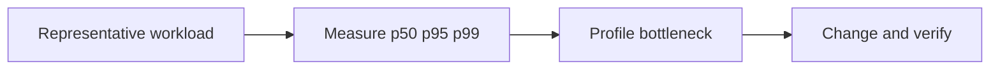

# Node.js Performance Overview

## Concept

Performance engineering measures user-facing latency and throughput, then attributes cost to event loop, CPU, GC, memory, pools, network, databases, serialization, compression, and queueing.

## Why It Exists

Optimizing without a workload and evidence frequently shifts bottlenecks or damages correctness.

## Mental Model



Treat every arrow as a boundary with a cost, ownership rule, cancellation behavior, and failure mode. Node.js is effective when those boundaries are explicit instead of hidden behind framework defaults.

## How It Works

The JavaScript callback runs on the main JavaScript thread. Native Node.js bindings, libuv, the operating system, worker threads, child processes, or remote services may perform work elsewhere. Completion only becomes useful when control returns to JavaScript. Under load, the important questions are what is queued, what is bounded, what can be cancelled, and which resource saturates first.

## Example

```js
import { performance, eventLoopUtilization } from 'node:perf_hooks';

const before = eventLoopUtilization();
const started = performance.now();
JSON.stringify(Array.from({length: 10_000}, (_, id) => ({id})));
console.log({
  durationMs: performance.now() - started,
  eventLoop: eventLoopUtilization(before),
});
```

The example is intentionally small enough to execute, but the production boundary is the important part: validate inputs, establish a deadline, propagate cancellation, classify failures, and release resources deterministically.

## Production Use

Define performance budgets, load test realistic data and dependencies, monitor tail latency, use keep-alive and bounded pools, and optimize the constrained resource.

## Security

Rate and size limits are performance and security controls. Ensure optimizations do not bypass validation, authorization, or cryptographic safety.

## Performance

Measure before/after under the same conditions and include warmup, GC, connection reuse, errors, and saturation.

## Common Mistakes

- Benchmarking a single in-process function and predicting service RPS.
- Ignoring p99 and queue wait.
- Increasing every pool independently.

## Debugging

Correlate latency with CPU profiles, heap/GC, event-loop delay, thread pool, DB pool, sockets, and downstream traces.

## Testing

Keep repeatable benchmark fixtures and performance regression thresholds in CI where stable.

## When Not to Use It

Do not micro-optimize syntax while database queries or network calls dominate.

## Interview Questions

- Throughput vs latency?
- What causes tail latency?
- How do you benchmark Node fairly?

## Official References

- [nodejs.org](https://nodejs.org/api/)
- [nodejs.org](https://nodejs.org/en/about/previous-releases)
