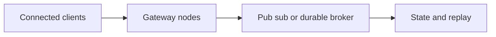

# Realtime Systems

## Concept

Realtime applications manage long-lived connections, presence, rooms, channels, heartbeats, ordering, acknowledgements, reconnection, fan-out, and horizontal scaling.

## Why It Exists

A socket connection is transient; product state and durable message semantics require additional storage and coordination.

## Mental Model



Treat every arrow as a boundary with a cost, ownership rule, cancellation behavior, and failure mode. Node.js is effective when those boundaries are explicit instead of hidden behind framework defaults.

## How It Works

The JavaScript callback runs on the main JavaScript thread. Native Node.js bindings, libuv, the operating system, worker threads, child processes, or remote services may perform work elsewhere. Completion only becomes useful when control returns to JavaScript. Under load, the important questions are what is queued, what is bounded, what can be cancelled, and which resource saturates first.

## Example

```ts
type Message = {id: string; roomId: string; sequence: number; body: string};

function canJoin(userTenant: string, roomTenant: string): boolean {
  return userTenant === roomTenant;
}

function orderBySequence(messages: readonly Message[]): Message[] {
  return [...messages].sort((a, b) => a.sequence - b.sequence);
}
```

The example is intentionally small enough to execute, but the production boundary is the important part: validate inputs, establish a deadline, propagate cancellation, classify failures, and release resources deterministically.

## Production Use

Authenticate connection establishment, authorize each room/channel, issue message IDs, define ack/retry/replay, use heartbeats, and share presence/fan-out through appropriate infrastructure.

## Security

Prevent tenant channel guessing, message injection, oversized frames, connection floods, token reuse, and sensitive presence leakage.

## Performance

Track concurrent connections, messages/sec, buffered bytes, fan-out amplification, broker lag, reconnect rate, and per-tenant quotas.

## Common Mistakes

- Treating Redis Pub/Sub as durable history.
- No backpressure policy for slow clients.
- Assuming connection order equals global message order.

## Debugging

Inspect close codes, heartbeat gaps, sequence IDs, node affinity, broker delivery, and reconnect storms.

## Testing

Test slow consumers, disconnect/reconnect, duplicates, missed messages, node loss, broker outage, and horizontal rebalance.

## When Not to Use It

Do not use realtime transport when polling at a suitable interval meets the product need more reliably.

## Interview Questions

- How do you scale WebSockets?
- What is presence?
- How do you provide ordered durable messages?

## Official References

- [nodejs.org](https://nodejs.org/api/)
- [nodejs.org](https://nodejs.org/en/about/previous-releases)
