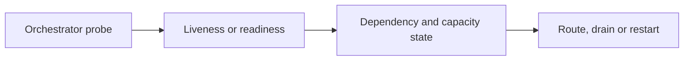

# Health Checks, Graceful Degradation and Crash Strategy

## Concept

Liveness answers whether the process should be restarted; readiness answers whether it should receive traffic; degradation keeps safe partial functionality during dependency failure.

## Why It Exists

Incorrect health checks can cause cascading restarts or route traffic to incapable instances.

## Mental Model



Treat every arrow as a boundary with a cost, ownership rule, cancellation behavior, and failure mode. Node.js is effective when those boundaries are explicit instead of hidden behind framework defaults.

## How It Works

The JavaScript callback runs on the main JavaScript thread. Native Node.js bindings, libuv, the operating system, worker threads, child processes, or remote services may perform work elsewhere. Completion only becomes useful when control returns to JavaScript. Under load, the important questions are what is queued, what is bounded, what can be cancelled, and which resource saturates first.

## Example

```ts
type Readiness = {
  acceptingTraffic: boolean;
  database: 'ready' | 'degraded' | 'down';
  queue: 'ready' | 'degraded' | 'down';
};

function ready(state: Readiness): boolean {
  return state.acceptingTraffic && state.database !== 'down';
}
```

The example is intentionally small enough to execute, but the production boundary is the important part: validate inputs, establish a deadline, propagate cancellation, classify failures, and release resources deterministically.

## Production Use

Keep liveness simple, make readiness reflect critical dependencies and shutdown state, and expose degraded capability through product-level behavior and metrics.

## Security

Health endpoints should reveal minimal information publicly and must not become unauthenticated diagnostic data dumps.

## Performance

Probes must be cheap and independent of expensive fan-out. Avoid synchronized checks that overload a recovering database.

## Common Mistakes

- Putting every dependency in liveness.
- Returning ready while shutdown is draining.
- Restarting on every transient downstream failure.

## Debugging

Correlate probe history, restarts, dependency state, queue depth, and deployment events.

## Testing

Test startup, dependency outage, recovery, overload, signal handling, and probe behavior during rolling deployments.

## When Not to Use It

Do not pretend a critical write path is healthy when data durability cannot be guaranteed; fail closed or disable the capability.

## Interview Questions

- Readiness vs liveness?
- When should a service degrade instead of fail?
- What failures justify process termination?

## Official References

- [nodejs.org](https://nodejs.org/api/)
- [nodejs.org](https://nodejs.org/en/about/previous-releases)
