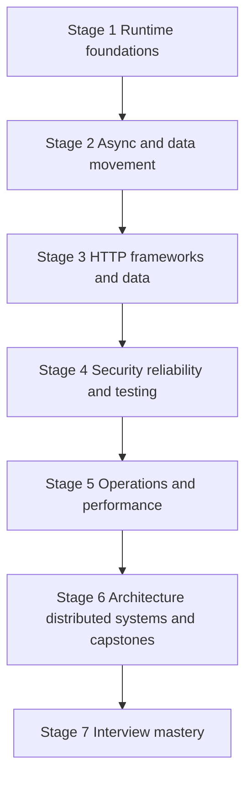

# Node.js Learning Roadmap

Use this roadmap sequentially on the first pass and as a diagnostic map later.



## Stage 1 — Runtime Foundations

Study JavaScript host differences, Node architecture, V8, libuv, process lifecycle, CLI, modules, npm and TypeScript.

Milestone: explain exactly which layer executes JavaScript, waits for I/O, performs thread-pool work, owns a socket, and terminates a process.

## Stage 2 — Async and Data Movement

Study event-loop phases, microtasks, nextTick, Promises, cancellation, concurrency limits, Buffers, Streams, files and events.

Milestone: process a multi-gigabyte input with bounded memory, cancellation, error cleanup and measured backpressure.

## Stage 3 — HTTP, Frameworks and Data

Build a core `node:http` API before Express, Fastify and NestJS. Add PostgreSQL, MongoDB, Redis, transactions, indexes, caches and background jobs.

Milestone: ship an idempotent write that remains correct across retries, replicas and a process crash.

## Stage 4 — Security, Reliability and Testing

Study authn, authz, OAuth/OIDC, Node threat patterns, timeouts, retries, circuits, health, queues and the complete testing pyramid.

Milestone: prove tenant isolation through negative authorization tests and recover safely from partial dependency failure.

## Stage 5 — Operations and Performance

Study diagnostics, logs/metrics/traces, event-loop and heap profiling, capacity, configuration, Docker, Kubernetes, CI/CD and graceful deployment.

Milestone: diagnose a p99 regression using evidence and deploy the fix through a canary with rollback.

## Stage 6 — Architecture and Capstones

Study modular monoliths, clean/hexagonal/vertical-slice designs, microservices, serverless, realtime systems, integrations, Node internals and distributed systems.

Build all ten capstones:

1. REST API with Node.js core
2. Production Express API
3. Fastify API platform
4. Authentication and authorization service
5. E-commerce backend
6. Multi-tenant SaaS backend
7. Realtime collaboration system
8. Background job and workflow platform
9. File-processing and media service
10. AI-powered backend application

Milestone: defend data ownership, transactions, idempotency, failure recovery, security, observability, deployment and first scaling bottleneck for each architecture.

## Stage 7 — Interview Mastery

Use the existing interview mastery track, 320-question bank and 15 mock rounds. Answer every deep question with:

```text
definition → runtime mechanism → production example → failure and security
→ performance evidence → testing → trade-offs → when not to use
```

## Suggested Study Cadence

- **Beginner:** 8–12 weeks, one stage at a time.
- **Working full-stack developer:** 6–8 weeks, prioritize runtime, HTTP, data, security and deployment.
- **Senior interview preparation:** 3–5 weeks, focus on event loop, streams, data, reliability, diagnostics, performance and architecture.
- **Production reference:** follow incident symptoms to the relevant focused page, then use the broader chapter and capstone for context.
