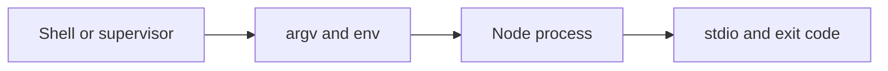

# CLI, REPL, Standard Streams and Environment

## Concept

Node exposes command-line arguments, standard input/output/error, TTY behavior, environment variables, the REPL, and process metadata for scripts and services.

## Why It Exists

CLIs and production processes need predictable parsing, exit codes, stream handling, and configuration behavior across shells and operating systems.

## Mental Model



Treat every arrow as a boundary with a cost, ownership rule, cancellation behavior, and failure mode. Node.js is effective when those boundaries are explicit instead of hidden behind framework defaults.

## How It Works

The JavaScript callback runs on the main JavaScript thread. Native Node.js bindings, libuv, the operating system, worker threads, child processes, or remote services may perform work elsewhere. Completion only becomes useful when control returns to JavaScript. Under load, the important questions are what is queued, what is bounded, what can be cancelled, and which resource saturates first.

## Example

```js
import process from 'node:process';

const [, , command = 'help', ...args] = process.argv;
if (command === 'echo') {
  process.stdout.write(`${args.join(' ')}\n`);
} else {
  process.stderr.write('Usage: node cli.js echo <text>\n');
  process.exitCode = 2;
}
```

The example is intentionally small enough to execute, but the production boundary is the important part: validate inputs, establish a deadline, propagate cancellation, classify failures, and release resources deterministically.

## Production Use

Use a dedicated parser for complex CLIs, keep stdout machine-readable when needed, send diagnostics to stderr, and define stable exit-code contracts.

## Security

Environment variables are untrusted strings. Validate them once, redact them from logs, and never expose server secrets through diagnostic endpoints.

## Performance

Respect stream backpressure for large output. Avoid synchronous startup work that makes commands or containers slow to become ready.

## Common Mistakes

- Parsing `process.argv` ad hoc across modules.
- Writing errors to stdout in automation-oriented tools.
- Assuming a TTY is always attached.

## Debugging

Reproduce with exact argv/env, inspect `process.stdin.isTTY`, and verify the parent process or container wiring.

## Testing

Test success, validation errors, signals, piped input, large output, and platform-specific path behavior by spawning the CLI.

## When Not to Use It

Do not use the interactive REPL as an operational control plane for production systems.

## Interview Questions

- Why distinguish stdout and stderr?
- How should a CLI communicate validation failure?
- Why validate environment variables at startup?

## Official References

- [nodejs.org](https://nodejs.org/api/)
- [nodejs.org](https://nodejs.org/en/about/previous-releases)
