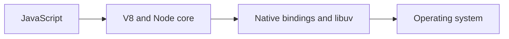

# Node.js Architecture

## Concept

Node.js combines V8, native bindings, core JavaScript modules, libuv, operating-system facilities, and optional workers or subprocesses into one runtime.

## Why It Exists

Senior engineers need to know which layer owns execution, waiting, memory, scheduling, and failure; otherwise performance and reliability diagnoses become guesswork.

## Mental Model



Treat every arrow as a boundary with a cost, ownership rule, cancellation behavior, and failure mode. Node.js is effective when those boundaries are explicit instead of hidden behind framework defaults.

## How It Works

The JavaScript callback runs on the main JavaScript thread. Native Node.js bindings, libuv, the operating system, worker threads, child processes, or remote services may perform work elsewhere. Completion only becomes useful when control returns to JavaScript. Under load, the important questions are what is queued, what is bounded, what can be cancelled, and which resource saturates first.

## Example

```js
import { versions, pid, platform } from 'node:process';
import { eventLoopUtilization } from 'node:perf_hooks';

const before = eventLoopUtilization();
setImmediate(() => {
  console.log({pid, platform, versions, elu: eventLoopUtilization(before)});
});
```

The example is intentionally small enough to execute, but the production boundary is the important part: validate inputs, establish a deadline, propagate cancellation, classify failures, and release resources deterministically.

## Production Use

Use this model when deciding whether work belongs on the main thread, libuv pool, worker thread, child process, database, queue, or another service.

## Security

Native addons and subprocesses widen the trusted computing base. Apply least privilege, pin dependencies, verify inputs at every native or process boundary, and use the Permission Model only as one defense layer.

## Performance

V8 executes JavaScript; libuv coordinates evented I/O and a worker pool for selected operations. CPU-heavy JavaScript remains blocking unless delegated.

## Common Mistakes

- Calling libuv the JavaScript engine.
- Assuming every async API uses the thread pool.
- Treating native code as memory-safe because it is called from JavaScript.

## Debugging

Correlate CPU profiles, event-loop delay, worker-pool saturation, active handles, and operating-system metrics to identify the responsible layer.

## Testing

Build small experiments for timers, filesystem, DNS, crypto, workers, and sockets; assert cancellation and cleanup behavior.

## When Not to Use It

Do not use architecture knowledge to depend on undocumented implementation details. Prefer public API contracts and measured behavior.

## Interview Questions

- What work does V8 perform?
- Which Node APIs commonly use libuv's worker pool?
- Why is Node not accurately described as a single-threaded runtime?

## Official References

- [nodejs.org](https://nodejs.org/api/)
- [docs.libuv.org](https://docs.libuv.org/)
- [v8.dev](https://v8.dev/docs)
