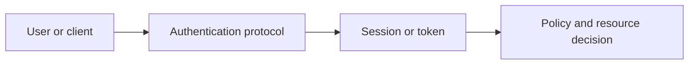

# Authentication, Authorization, OAuth and OIDC

## Concept

Authentication establishes identity; authorization evaluates whether that identity may perform an operation on a resource in context.

## Why It Exists

Sessions, cookies, JWTs, OAuth, OIDC, PKCE, API keys, passkeys, and MFA solve different parts of identity and delegated access.

## Mental Model



Treat every arrow as a boundary with a cost, ownership rule, cancellation behavior, and failure mode. Node.js is effective when those boundaries are explicit instead of hidden behind framework defaults.

## How It Works

The JavaScript callback runs on the main JavaScript thread. Native Node.js bindings, libuv, the operating system, worker threads, child processes, or remote services may perform work elsewhere. Completion only becomes useful when control returns to JavaScript. Under load, the important questions are what is queued, what is bounded, what can be cancelled, and which resource saturates first.

## Example

```ts
type Resource = {id: string; tenantId: string; ownerId: string};
type Principal = {subject: string; tenantId: string; roles: readonly string[]};

function canRead(principal: Principal, resource: Resource): boolean {
  return principal.tenantId === resource.tenantId &&
    (principal.subject === resource.ownerId || principal.roles.includes('admin'));
}
```

The example is intentionally small enough to execute, but the production boundary is the important part: validate inputs, establish a deadline, propagate cancellation, classify failures, and release resources deterministically.

## Production Use

Prefer secure server-side sessions for browser applications when appropriate, use OIDC for login federation, OAuth for delegated authorization, PKCE for public clients, and centralized policy helpers with object checks.

## Security

Hash passwords with a password KDF, set secure cookie attributes, rotate refresh tokens, validate issuer/audience/signature/expiry, prevent CSRF and replay, and protect account recovery.

## Performance

Authentication endpoints need rate limits and bounded hashing concurrency. Token verification should avoid repeated remote key fetches while honoring rotation.

## Common Mistakes

- Using JWTs because they are called stateless.
- Trusting a role from a request body.
- Using OAuth access tokens as proof of end-user identity without OIDC semantics.

## Debugging

Log safe auth event codes, issuer, client ID, subject pseudonym, policy decision, and failure reason without tokens.

## Testing

Test expiry, clock skew, revocation, rotation reuse, tenant boundaries, object ownership, CSRF, PKCE, and account enumeration.

## When Not to Use It

Do not implement an identity provider unless identity infrastructure is the product and the security investment is justified.

## Interview Questions

- OAuth vs OIDC?
- Session cookie vs JWT?
- What is refresh-token rotation and reuse detection?

## Official References

- [oauth.net](https://oauth.net/2/)
- [openid.net](https://openid.net/developers/how-connect-works/)
- [www.rfc-editor.org](https://www.rfc-editor.org/rfc/rfc7636)
