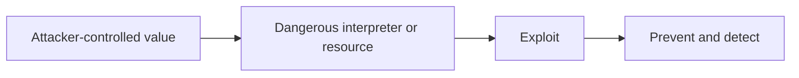

# Node.js Threat Catalog and Secure Patterns

## Concept

Common backend threats include SQL and NoSQL injection, command injection, path traversal, SSRF, prototype pollution, mass assignment, unsafe deserialization, open redirects, request smuggling, and supply-chain compromise.

## Why It Exists

A catalog links each threat to the boundary, exploit condition, prevention, detection, and recovery plan.

## Mental Model



Treat every arrow as a boundary with a cost, ownership rule, cancellation behavior, and failure mode. Node.js is effective when those boundaries are explicit instead of hidden behind framework defaults.

## How It Works

The JavaScript callback runs on the main JavaScript thread. Native Node.js bindings, libuv, the operating system, worker threads, child processes, or remote services may perform work elsewhere. Completion only becomes useful when control returns to JavaScript. Under load, the important questions are what is queued, what is bounded, what can be cancelled, and which resource saturates first.

## Example

```js
import { execFile } from 'node:child_process';
import { promisify } from 'node:util';

const run = promisify(execFile);
const allowed = new Set(['status', 'version']);

async function safeTool(action) {
  if (!allowed.has(action)) throw new Error('unsupported action');
  return run('/usr/local/bin/app-tool', [action], {timeout: 2_000, shell: false});
}
```

The example is intentionally small enough to execute, but the production boundary is the important part: validate inputs, establish a deadline, propagate cancellation, classify failures, and release resources deterministically.

## Production Use

Use parameterized data APIs, allowlisted outbound destinations and commands, canonical storage identifiers, null-prototype objects where needed, explicit DTO mapping, and hardened proxy configuration.

## Security

Treat every interpreter and resolver boundary as dangerous: SQL, shell, template, URL, path, regex, JSON merge, package installation, and native addon.

## Performance

Security checks must be bounded. Avoid catastrophic regex, recursive merge, unlimited DNS/redirect chains, huge error logs, and expensive per-request scans.

## Common Mistakes

- Escaping instead of parameterizing SQL.
- Blocking `127.0.0.1` but allowing SSRF through DNS rebinding or alternate IP forms.
- Spreading request bodies directly into domain models.

## Debugging

Record normalized security event types and safe fingerprints. Preserve forensic context while redacting secrets and personal data.

## Testing

Use adversarial fixtures, fuzzing, redirect/DNS tests, malicious object keys, command/path variants, and dependency compromise drills.

## When Not to Use It

Do not rely on a web application firewall as the only prevention for unsafe application code.

## Interview Questions

- How does prototype pollution happen?
- How do you defend against SSRF?
- Why is execFile safer than exec with a shell?

## Official References

- [nodejs.org](https://nodejs.org/api/)
- [nodejs.org](https://nodejs.org/en/about/previous-releases)
