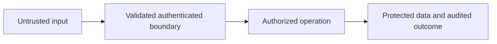

# Node.js Security Overview

## Concept

Secure Node systems combine input validation, authentication, authorization, safe data access, secret management, dependency security, transport controls, observability, and operational isolation.

## Why It Exists

No single middleware, scanner, or Permission Model flag can secure an application.

## Mental Model



Treat every arrow as a boundary with a cost, ownership rule, cancellation behavior, and failure mode. Node.js is effective when those boundaries are explicit instead of hidden behind framework defaults.

## How It Works

The JavaScript callback runs on the main JavaScript thread. Native Node.js bindings, libuv, the operating system, worker threads, child processes, or remote services may perform work elsewhere. Completion only becomes useful when control returns to JavaScript. Under load, the important questions are what is queued, what is bounded, what can be cancelled, and which resource saturates first.

## Example

```ts
type Principal = {userId: string; tenantId: string; permissions: ReadonlySet<string>};

function requirePermission(principal: Principal, tenantId: string, permission: string): void {
  if (principal.tenantId !== tenantId || !principal.permissions.has(permission)) {
    const error = new Error('forbidden');
    Object.assign(error, {statusCode: 403});
    throw error;
  }
}
```

The example is intentionally small enough to execute, but the production boundary is the important part: validate inputs, establish a deadline, propagate cancellation, classify failures, and release resources deterministically.

## Production Use

Build a threat model, define trust boundaries, use secure defaults, minimize privileges, patch dependencies, protect secrets, and rehearse incident response.

## Security

Cover injection, traversal, SSRF, prototype pollution, mass assignment, deserialization, CORS/CSRF, token theft, tenant isolation, brute force, file uploads, webhooks, and supply chain.

## Performance

Security controls can be abused for resource exhaustion. Bound hashing, validation, logging, rate-limit state, and security scanning.

## Common Mistakes

- Checking roles without object ownership.
- Logging tokens or passwords during debugging.
- Using CORS as authorization.

## Debugging

Preserve safe audit events, request IDs, auth decision codes, dependency versions, and evidence without exposing secrets.

## Testing

Add negative authorization, fuzzing, dependency, secret, upload, webhook, rate-limit, and incident tests.

## When Not to Use It

Do not run untrusted tenant code in the application process; use strong isolation.

## Interview Questions

- Authentication vs authorization?
- How do you prevent broken object-level authorization?
- What does defense in depth mean in Node?

## Official References

- [owasp.org](https://owasp.org/www-project-top-ten/)
- [nodejs.org](https://nodejs.org/en/learn/getting-started/security-best-practices)
