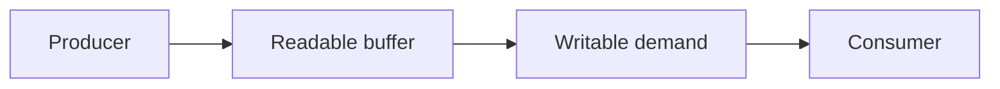

# Stream Backpressure

## Concept

Backpressure slows producers when consumers cannot safely accept more data, keeping memory bounded across files, HTTP, compression, transforms, and exports.

## Why It Exists

Without backpressure, a fast producer can fill memory while a slow disk, client, parser, or network dependency falls behind.

## Mental Model



Treat every arrow as a boundary with a cost, ownership rule, cancellation behavior, and failure mode. Node.js is effective when those boundaries are explicit instead of hidden behind framework defaults.

## How It Works

The JavaScript callback runs on the main JavaScript thread. Native Node.js bindings, libuv, the operating system, worker threads, child processes, or remote services may perform work elsewhere. Completion only becomes useful when control returns to JavaScript. Under load, the important questions are what is queued, what is bounded, what can be cancelled, and which resource saturates first.

## Example

```js
import { createReadStream, createWriteStream } from 'node:fs';
import { pipeline } from 'node:stream/promises';
import { createGzip } from 'node:zlib';

await pipeline(
  createReadStream(new URL(import.meta.url)),
  createGzip(),
  createWriteStream('/tmp/source.js.gz'),
);
```

The example is intentionally small enough to execute, but the production boundary is the important part: validate inputs, establish a deadline, propagate cancellation, classify failures, and release resources deterministically.

## Production Use

Use `pipeline`, async iteration, bounded transforms, and cancellation. Choose object mode only for true object workflows and measure high-water marks.

## Security

Enforce total byte and decompressed-size limits, handle partial uploads, sanitize destinations, and destroy streams on authorization or validation failure.

## Performance

Tune high-water marks only after observing memory, throughput, and consumer behavior. A larger buffer can increase throughput or simply increase memory and latency.

## Common Mistakes

- Ignoring the return value of `writable.write`.
- Using `data` events and manual piping without error cleanup.
- Loading a large export into one Buffer.

## Debugging

Track bytes in/out, buffer length, pause/resume behavior, consumer latency, and stream destruction reasons.

## Testing

Use a deliberately slow writable and assert bounded memory, error propagation, abort behavior, and incomplete-output cleanup.

## When Not to Use It

Do not introduce streams for tiny values where whole-value processing is simpler and safe.

## Interview Questions

- What does `writable.write()` returning false mean?
- Why is pipeline safer than pipe?
- How do Web Streams interoperate with Node streams?

## Official References

- [nodejs.org](https://nodejs.org/api/stream.html)
- [nodejs.org](https://nodejs.org/en/learn/modules/backpressuring-in-streams)
