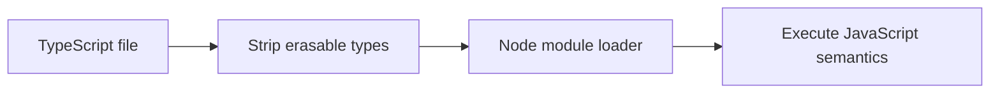

# NodeNext, ESM and Native Type Stripping

## Concept

Node can execute erasable TypeScript syntax through stable type stripping, but it does not type-check, transform tsconfig paths, or provide a full build pipeline.

## Why It Exists

Teams need a clear choice between lightweight direct execution and a normal TypeScript compiler or runtime tool.

## Mental Model



Treat every arrow as a boundary with a cost, ownership rule, cancellation behavior, and failure mode. Node.js is effective when those boundaries are explicit instead of hidden behind framework defaults.

## How It Works

The JavaScript callback runs on the main JavaScript thread. Native Node.js bindings, libuv, the operating system, worker threads, child processes, or remote services may perform work elsewhere. Completion only becomes useful when control returns to JavaScript. Under load, the important questions are what is queued, what is bounded, what can be cancelled, and which resource saturates first.

## Example

```ts
// package.json: { "type": "module" }
type UserId = string & {readonly __brand: 'UserId'};

export function parseUserId(value: string): UserId {
  if (!/^[a-f0-9-]{36}$/.test(value)) throw new Error('invalid user id');
  return value as UserId;
}

console.log(parseUserId('123e4567-e89b-12d3-a456-426614174000'));
```

The example is intentionally small enough to execute, but the production boundary is the important part: validate inputs, establish a deadline, propagate cancellation, classify failures, and release resources deterministically.

## Production Use

Use native stripping for scripts and tooling that stay within erasable syntax. Use `tsx`, `tsc`, or another build tool for complete syntax, type checking, declarations, bundling, or compatibility transforms.

## Security

Direct execution does not validate runtime values and refuses TypeScript under `node_modules`. Keep package publication as JavaScript plus declarations.

## Performance

Stripping preserves line locations and avoids a transform step, but type checking still belongs in CI. Compare startup and developer workflow rather than assuming it is always faster.

## Common Mistakes

- Assuming Node reads tsconfig.
- Using enums or parameter properties without checking support.
- Omitting `type` from type-only imports.

## Debugging

Run with `--no-strip-types` to prove which syntax is being handled, inspect module markers, and test the exact supported Node line.

## Testing

CI should run `tsc --noEmit` and execute the application on the chosen Node LTS line.

## When Not to Use It

Do not use native stripping as a substitute for producing compatible, documented packages.

## Interview Questions

- What does Node type stripping do?
- Which tsconfig features are intentionally ignored?
- Why is `import type` important?

## Official References

- [nodejs.org](https://nodejs.org/api/typescript.html)
- [www.typescriptlang.org](https://www.typescriptlang.org/docs/)
