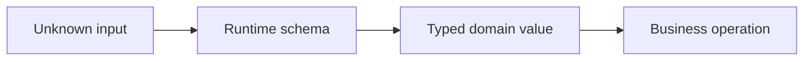

# Runtime Validation and Typed API Contracts

## Concept

TypeScript checks trusted program structure at development time; runtime schemas check untrusted values crossing process boundaries.

## Why It Exists

Backends ingest data from users, databases, queues, environment variables, files, and providers that can violate declared types.

## Mental Model



Treat every arrow as a boundary with a cost, ownership rule, cancellation behavior, and failure mode. Node.js is effective when those boundaries are explicit instead of hidden behind framework defaults.

## How It Works

The JavaScript callback runs on the main JavaScript thread. Native Node.js bindings, libuv, the operating system, worker threads, child processes, or remote services may perform work elsewhere. Completion only becomes useful when control returns to JavaScript. Under load, the important questions are what is queued, what is bounded, what can be cancelled, and which resource saturates first.

## Example

```ts
type CreateUser = {email: string; age: number};

function parseCreateUser(value: unknown): CreateUser {
  if (!value || typeof value !== 'object') throw new Error('object required');
  const input = value as Record<string, unknown>;
  if (typeof input.email !== 'string' || !input.email.includes('@')) throw new Error('invalid email');
  if (!Number.isInteger(input.age) || (input.age as number) < 13) throw new Error('invalid age');
  return {email: input.email, age: input.age as number};
}
```

The example is intentionally small enough to execute, but the production boundary is the important part: validate inputs, establish a deadline, propagate cancellation, classify failures, and release resources deterministically.

## Production Use

Validate once at ingress, convert into domain-specific values, and generate or compare OpenAPI, event, and SDK contracts where appropriate.

## Security

Reject unknown or dangerous fields, cap nesting and size, avoid mass assignment, and do not trust client-supplied authorization attributes.

## Performance

Schema validation consumes CPU proportional to payload complexity. Set body limits and avoid validating huge documents synchronously on the main thread.

## Common Mistakes

- Casting parsed JSON to an interface.
- Duplicating schemas in five layers with drift.
- Returning detailed internal validation errors to untrusted callers.

## Debugging

Log schema name and safe issue codes, preserve the original cause internally, and add contract version metadata.

## Testing

Use property-based, boundary, malformed, oversized, and backward-compatibility tests.

## When Not to Use It

Do not validate already trusted internal values repeatedly in every layer; establish and document trust boundaries.

## Interview Questions

- Why are TypeScript types insufficient at an HTTP boundary?
- How do you prevent contract drift?
- Where should validation occur?

## Official References

- [nodejs.org](https://nodejs.org/api/)
- [nodejs.org](https://nodejs.org/en/about/previous-releases)
