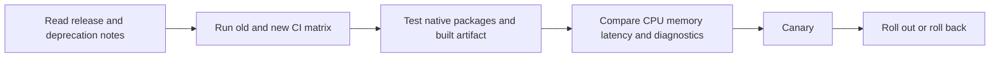

# Current Node.js Release and Platform Baseline

**Research date:** August 2, 2026.

This page records the versions and stability assumptions used by the handbook. Patch versions move quickly; always verify the official release page before a production rollout.

## Supported Runtime Lines

| Line | Status on the research date | Selected release | Handbook use |
|---|---|---:|---|
| Node.js 26 | Current | **v26.5.0** | newest current behavior; evaluate before production |
| Node.js 24 “Krypton” | Active LTS | **v24.18.0** | **production and CI baseline** |
| Node.js 22 “Jod” | Maintenance LTS | **v22.23.1** | supported migration and compatibility line |
| Node.js 25 | End of life | — | migration-only; do not deploy |
| Node.js 20 | End of life | — | migration-only; upgrade |

The Node project recommends production applications use Active LTS or Maintenance LTS releases. This repository runs Node.js **24 LTS** in GitHub Actions.

## Bundled Runtime Components

The official archives report:

| Node release | npm | V8 |
|---|---:|---:|
| v24.18.0 LTS | **11.16.0** | 13.6 series |
| v26.5.0 Current | **11.17.0** | 14.6 series |

Do not couple application code to a V8 implementation detail merely because it is visible in one runtime release.

## TypeScript Baseline

The full handbook baseline is **TypeScript 7.0.2** with strict checking. TypeScript 7 is the current stable compiler line on the research date.

Node.js built-in TypeScript type stripping is **stable** in v24.12.0 and later and in the current v26 line. It:

- executes TypeScript containing erasable syntax;
- does **not** type-check;
- ignores `tsconfig.json`;
- does not transform `paths`;
- requires explicit type-only imports where appropriate;
- refuses to execute TypeScript located under `node_modules`;
- is suitable for lightweight scripts but not a complete library build pipeline.

Use `tsc`, `tsx`, or another maintained build/runtime tool when full syntax, type checking, declarations, transforms, bundling or compatibility output is required.

## ECMAScript Baseline

Node.js executes modern ECMAScript through its bundled V8 engine. The handbook uses syntax supported by the selected Node.js 24 LTS baseline and does not present proposal-stage syntax as standard JavaScript. For runtime-sensitive features:

1. check the selected Node release;
2. check the Node API stability label;
3. use feature detection when multiple supported lines differ;
4. add a version-matrix test where compatibility matters.

## CommonJS and ES Modules

Both **CommonJS** and **ES Modules** are supported.

- New applications and packages may choose ESM with an explicit `"type": "module"`.
- CommonJS remains valid where package, tool or host compatibility requires it.
- `.mjs` is always ESM and `.cjs` is always CommonJS.
- Package `exports` and `imports` are public and internal contract tools.
- Ambiguous module detection is not a reason to omit explicit package metadata.
- Dual packages require an explicit interoperability and test strategy.

## Built-In Test Runner

The `node:test` module is **stable**. It supports tests, suites, hooks, assertions, mocking, timers, reporters, filtering, concurrency and command-line execution. Individual subfeatures can have their own stability labels; this handbook labels version-sensitive test features rather than assuming the whole module shares one status.

## Permission Model

The Node.js **Permission Model** is **stable** and can restrict filesystem, network, child-process, worker, native-addon, WASI, FFI and inspector capabilities when enabled.

It is not a hostile-code sandbox. It supplements, rather than replaces:

- operating-system users and permissions;
- containers or stronger isolation;
- network policy;
- secret-manager policy;
- application authorization;
- dependency and native-addon trust.

## Web APIs in Node.js

Supported Node lines expose many Web-compatible APIs, including `fetch`, `Request`, `Response`, `Headers`, `URL`, `URLSearchParams`, `AbortController`, `AbortSignal`, Web Streams, `Blob`, `FormData`, `TextEncoder`, `TextDecoder`, `structuredClone`, Web Crypto and timers.

Compatibility does not imply browser identity. Node has no DOM, has different process and security boundaries, and may expose runtime-specific extensions or stability labels.

## Stability Labels

| Label | Handbook meaning |
|---|---|
| Stable | safe to teach as a supported public contract for the stated runtime line |
| Release candidate | usable only with an explicit version note and compatibility plan |
| Experimental | can change outside normal semantic-version guarantees; not a default production recommendation |
| Deprecated | migration knowledge only; avoid in new code |
| Removed | historical context only |
| Runtime-specific | behavior differs between Node, browsers, Bun, Deno or edge runtimes |
| Platform-specific | behavior differs across Linux, macOS, Windows or CPU architectures |

## Upgrade Rule

Treat every Node major upgrade as a runtime migration:

## Primary Sources

- [Node.js releases](https://nodejs.org/en/about/previous-releases)
- [Node.js v24.18.0 archive](https://nodejs.org/en/download/archive/v24.18.0)
- [Node.js v26.5.0 archive](https://nodejs.org/en/download/archive/v26.5.0)
- [Node.js API documentation](https://nodejs.org/api/)
- [Node.js TypeScript documentation](https://nodejs.org/api/typescript.html)
- [Node.js Permission Model](https://nodejs.org/api/permissions.html)
- [Node.js test runner](https://nodejs.org/api/test.html)
- [TypeScript 7 announcement](https://devblogs.microsoft.com/typescript/announcing-typescript-7-0/)
- [TypeScript npm package](https://www.npmjs.com/package/typescript)
