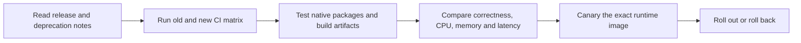

# Version and Platform Support

**Research date:** August 2, 2026.

This is the canonical version-support entry for the Node.js handbook. It summarizes the production baseline and links to the [detailed release and stability record](./version-baseline).

## Recommended Runtime Baseline

| Runtime line | Status on August 2, 2026 | Selected release | Handbook position |
|---|---|---:|---|
| Node.js 24 “Krypton” | Active LTS | **v24.18.0** | Default production and CI baseline |
| Node.js 22 “Jod” | Maintenance LTS | **v22.23.1** | Supported compatibility and migration line |
| Node.js 26 | Current | **v26.5.0** | Evaluate new behavior before production adoption |
| Node.js 25 | End of life | — | Do not deploy |
| Node.js 20 | End of life | — | Upgrade planning only |

Production services should normally run an Active LTS or Maintenance LTS release. Pin the exact runtime in CI, containers and deployment platforms; test upgrades as runtime migrations rather than assuming a major release is transparent.

## npm and TypeScript

The selected Node.js 24.18.0 archive bundles **npm 11.16.0**. The handbook’s full compiler baseline is **TypeScript 7.0.2** with strict checking.

Node.js built-in TypeScript type stripping is stable in the selected Node.js 24 line, but it is deliberately limited:

- it removes erasable TypeScript syntax;
- it does not type-check;
- it does not apply `tsconfig.json` transforms or `paths` aliases;
- it does not replace a library build, declaration generation or compatibility pipeline.

Use `tsc`, `tsx` or another maintained tool when the application needs full TypeScript semantics, build output, declarations, bundling or target compatibility.

## Modules

Both **CommonJS** and **ES Modules** are supported public module systems.

- Prefer explicit package metadata such as `"type": "module"`.
- `.mjs` is always ESM and `.cjs` is always CommonJS.
- Package `exports` and `imports` define package boundaries.
- Test CommonJS/ESM interoperability and dual-package behavior on every supported runtime line.

New applications may choose ESM, but CommonJS remains valid when package, tool or host compatibility requires it.

## Built-In Test Runner and Permission Model

The `node:test` runner is stable and is suitable for unit, integration and API testing without a third-party runner. Individual subfeatures can still have their own stability labels, so version-sensitive behavior must be checked against the selected runtime documentation.

The Node.js **Permission Model** is stable. It can reduce filesystem, network, worker, child-process, native-addon and inspector capabilities, but it is not a hostile-code sandbox. Keep operating-system isolation, container policy, network controls, secret management and application authorization in place.

## Web-Compatible APIs

Supported Node.js lines provide Web-compatible APIs such as `fetch`, `Request`, `Response`, `Headers`, `URL`, `AbortController`, Web Streams, `Blob`, `FormData`, `TextEncoder`, `structuredClone` and Web Crypto.

Compatibility does not make Node.js a browser: there is no DOM, the process and security boundaries differ, and runtime-specific extensions or stability labels still apply.

## Stability Rules

| Label | How the handbook treats it |
|---|---|
| Stable | Recommended as a supported public contract for the stated runtime line |
| Release candidate | Use only with a version note and compatibility plan |
| Experimental | Never present as a default stable production recommendation |
| Deprecated | Migration knowledge; avoid in new code |
| Removed | Historical context only |
| Runtime-specific | Behavior differs across Node.js, browsers, Bun, Deno or edge runtimes |
| Platform-specific | Behavior differs across Linux, macOS, Windows or CPU architectures |

## Upgrade Workflow

Always verify the latest patch releases and stability labels from primary sources before a production rollout.

## Primary Sources

- [Node.js release schedule and supported lines](https://nodejs.org/en/about/previous-releases)
- [Node.js v24.18.0 archive](https://nodejs.org/en/download/archive/v24.18.0)
- [Node.js v26.5.0 archive](https://nodejs.org/en/download/archive/v26.5.0)
- [Node.js TypeScript documentation](https://nodejs.org/api/typescript.html)
- [Node.js Permission Model](https://nodejs.org/api/permissions.html)
- [Node.js test runner](https://nodejs.org/api/test.html)
- [TypeScript 7 announcement](https://devblogs.microsoft.com/typescript/announcing-typescript-7-0/)
