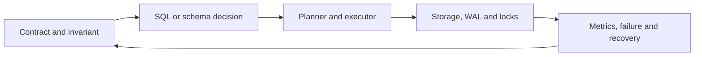

# PostgreSQL Index Design

> **Baseline:** PostgreSQL 18.4, researched August 3, 2026. Version-specific, extension-specific and managed-provider behavior is labelled where it matters.

An index is a maintained access structure, not a universal speed switch. Match access method, key order, predicates and operators to the workload.



## Mental model

Start by naming the invariant and the owner. PostgreSQL receives a statement inside a session and transaction context, resolves names and types, plans executable work, coordinates visibility and locks, then changes or reads durable state. A production decision is incomplete until its failure behavior, observability and recovery path are understood.

For this topic, separate four questions:

1. **Semantics:** What result or state is correct?
2. **Mechanism:** Which PostgreSQL feature enforces or computes it?
3. **Workload:** How do data distribution, concurrency and access patterns change the cost?
4. **Operations:** How is the behavior measured, migrated, backed up and recovered?

## Concepts covered

- **B-tree,** — B-tree, hash, GIN, GiST, SP-GiST and BRIN; connect the feature to correctness, execution cost, concurrency and operations.
- **Multicolumn** — multicolumn and covering indexes; connect the feature to correctness, execution cost, concurrency and operations.
- **Included** — included columns; connect the feature to correctness, execution cost, concurrency and operations.
- **Partial** — partial and expression indexes; connect the feature to correctness, execution cost, concurrency and operations.
- **Operator** — operator classes and collations; connect the feature to correctness, execution cost, concurrency and operations.
- **Selectivity** — selectivity and index-only scans; connect the feature to correctness, execution cost, concurrency and operations.
- **Bitmap** — bitmap scans; connect the feature to correctness, execution cost, concurrency and operations.
- **Unused,** — unused, duplicate and bloated indexes; connect the feature to correctness, execution cost, concurrency and operations.
- **Create** — CREATE INDEX CONCURRENTLY and REINDEX; connect the feature to correctness, execution cost, concurrency and operations.
- **Jsonb,** — JSONB, arrays, text and geospatial indexes; connect the feature to correctness, execution cost, concurrency and operations.

## Practical example

```sql
CREATE INDEX CONCURRENTLY orders_open_customer_created_idx
ON orders (customer_id, created_at DESC)
INCLUDE (total)
WHERE status IN ('pending', 'paid');

EXPLAIN (ANALYZE, BUFFERS)
SELECT created_at, total
FROM orders
WHERE customer_id = 42
  AND status = 'paid'
ORDER BY created_at DESC
LIMIT 20;
```

Read the example as a contract, not a snippet to paste blindly. Verify required extensions, privileges, transaction boundaries and destructive effects in a disposable environment. Application values must be parameterized; credentials shown in development commands are intentionally fake.

## How PostgreSQL executes the decision

PostgreSQL parses and analyzes the statement, resolves operators and casts, rewrites views or rules where applicable, and asks the planner to compare candidate paths. Estimates come from table and column statistics; the executor then pulls tuples through plan nodes. MVCC controls visibility while heavyweight, row, predicate or advisory locks coordinate conflicts. Changes generate WAL before modified data pages are eventually flushed.

This means the same syntactically correct statement can behave differently as row counts, value distributions, statistics, cache state, indexes, concurrent sessions and configuration change. Use `EXPLAIN (ANALYZE, BUFFERS, WAL)` only when it is safe to run the statement; plain `EXPLAIN` does not execute it.

## Correctness and concurrency

Define the transaction boundary around the business invariant. Do not split a single invariant across unrelated pool checkouts. Prefer constraints for states PostgreSQL can express, and handle expected SQLSTATE values explicitly. Serializable transactions and deadlocks may require bounded retries of the **whole** transaction, not only the final query.

Long-running or idle-in-transaction sessions retain snapshots, locks and old tuple visibility. They can prevent vacuum cleanup, increase bloat and surprise migrations. Set application-level deadlines and expose transaction age in monitoring.

## Performance reasoning

Measure before changing anything. Capture representative parameters, actual row counts, call frequency and latency percentiles. Compare estimated versus actual rows at each decisive plan node. An index can reduce reads but increases write work, WAL, storage and maintenance. Memory settings are often per operation or per connection, so multiplying them by concurrency matters.

A strong optimization states the bottleneck, evidence, proposed mechanism, expected metric change, safety boundary and rollback. “Add an index” or “increase memory” without those details is not a production plan.

## Common mistakes and failure modes

- Treating development data as representative of production distributions.
- Relying on application validation while leaving the database able to store invalid states.
- Building SQL with string concatenation instead of parameters.
- Holding a transaction open during network calls or user interaction.
- Assuming managed PostgreSQL removes responsibility for query plans, locks and schema design.
- Using destructive commands without a verified backup, target check and rollback procedure.
- Responding to every incident by restarting or clearing caches before preserving evidence.
- Ignoring time zones, collations, locale, extension versions or provider restrictions.

## Security and operational guidance

Use separate migration, runtime, read-only and administrative roles. Grant the minimum object privileges and review ownership, `search_path`, row-level security and `SECURITY DEFINER` functions as security boundaries. Require TLS for untrusted networks, prefer SCRAM authentication, rotate secrets outside source control and redact sensitive values from logs.

For operational changes, record the target cluster, database, schema, expected lock, estimated duration, verification query, abort condition and recovery procedure. Test backups by restoring them. Test failover and migrations with production-like data and concurrency.

## Debugging procedure

1. Record the exact error, SQLSTATE, server version, database, role and application build.
2. Decide whether the dominant domain is connection, permission, query plan, lock, I/O, CPU, memory, WAL, vacuum, replication or application behavior.
3. Inspect `pg_stat_activity`, wait events, blockers and relevant statistics without destroying evidence.
4. Reproduce with the same schema, parameters and representative data distribution.
5. Form one falsifiable hypothesis and gather the plan or metric that would prove it.
6. Apply the smallest reversible change.
7. Verify correctness first, then latency, throughput, resource use and secondary effects.
8. Document the cause, detection gap and prevention change.

## Interview reasoning

A senior answer explains mechanism and trade-offs, not only syntax. Draw the path from application request to session, transaction, planner, executor, storage, WAL and observability. State what changes under concurrency and how failures are retried or recovered. Distinguish SQL-standard behavior, PostgreSQL-specific behavior, extension behavior and provider behavior.

## Exercises

1. Adapt the example to a multi-tenant schema and identify the isolation boundary.
2. Produce an `EXPLAIN` plan with representative data and explain estimated versus actual rows.
3. Design one failure injection that tests timeout, rollback or retry behavior.
4. Write a least-privilege role and privilege plan for the example.
5. Define the dashboard signal and runbook step that would detect degradation.

## Related deep archive

The existing 192-topic PostgreSQL archive remains available from [/docs/postgresql/00-start-here](/docs/postgresql/00-start-here). Use this focused guide for the canonical decision path and the archive for command-by-command drills and additional examples.
