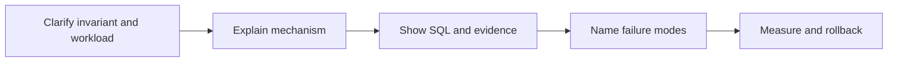

# PostgreSQL Interview Preparation

## SQL and NULL semantics

Give a concise definition, an executable example, a detailed mechanism explanation, one production failure, evidence from catalogs/plans/metrics, a safe rollback, follow-up questions, a common weak answer, and senior-level trade-off reasoning. Distinguish SQL-standard, PostgreSQL, extension, and provider behavior.

## relational design and constraints

Give a concise definition, an executable example, a detailed mechanism explanation, one production failure, evidence from catalogs/plans/metrics, a safe rollback, follow-up questions, a common weak answer, and senior-level trade-off reasoning. Distinguish SQL-standard, PostgreSQL, extension, and provider behavior.

## joins and analytical SQL

Give a concise definition, an executable example, a detailed mechanism explanation, one production failure, evidence from catalogs/plans/metrics, a safe rollback, follow-up questions, a common weak answer, and senior-level trade-off reasoning. Distinguish SQL-standard, PostgreSQL, extension, and provider behavior.

## transactions and MVCC

Give a concise definition, an executable example, a detailed mechanism explanation, one production failure, evidence from catalogs/plans/metrics, a safe rollback, follow-up questions, a common weak answer, and senior-level trade-off reasoning. Distinguish SQL-standard, PostgreSQL, extension, and provider behavior.

## locks and deadlocks

Give a concise definition, an executable example, a detailed mechanism explanation, one production failure, evidence from catalogs/plans/metrics, a safe rollback, follow-up questions, a common weak answer, and senior-level trade-off reasoning. Distinguish SQL-standard, PostgreSQL, extension, and provider behavior.

## index design and EXPLAIN

Give a concise definition, an executable example, a detailed mechanism explanation, one production failure, evidence from catalogs/plans/metrics, a safe rollback, follow-up questions, a common weak answer, and senior-level trade-off reasoning. Distinguish SQL-standard, PostgreSQL, extension, and provider behavior.

## vacuum and storage

Give a concise definition, an executable example, a detailed mechanism explanation, one production failure, evidence from catalogs/plans/metrics, a safe rollback, follow-up questions, a common weak answer, and senior-level trade-off reasoning. Distinguish SQL-standard, PostgreSQL, extension, and provider behavior.

## security and RLS

Give a concise definition, an executable example, a detailed mechanism explanation, one production failure, evidence from catalogs/plans/metrics, a safe rollback, follow-up questions, a common weak answer, and senior-level trade-off reasoning. Distinguish SQL-standard, PostgreSQL, extension, and provider behavior.

## backup and PITR

Give a concise definition, an executable example, a detailed mechanism explanation, one production failure, evidence from catalogs/plans/metrics, a safe rollback, follow-up questions, a common weak answer, and senior-level trade-off reasoning. Distinguish SQL-standard, PostgreSQL, extension, and provider behavior.

## replication, HA and migrations

Give a concise definition, an executable example, a detailed mechanism explanation, one production failure, evidence from catalogs/plans/metrics, a safe rollback, follow-up questions, a common weak answer, and senior-level trade-off reasoning. Distinguish SQL-standard, PostgreSQL, extension, and provider behavior.

## Incident framework

Preserve evidence, contain safely, test one falsifiable hypothesis, apply the smallest reversible change, verify user and database metrics, then document prevention and ownership.
