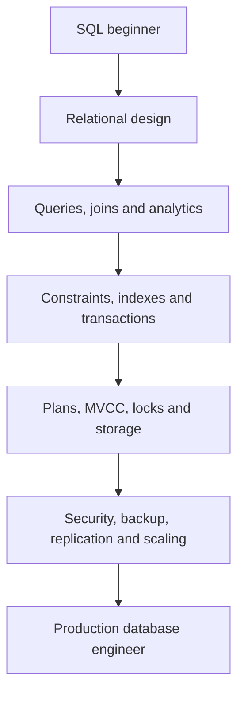

# PostgreSQL Developer Handbook

This handbook teaches SQL through PostgreSQL and then moves beyond syntax into schema design, query execution, MVCC, locks, storage, WAL, recovery, replication, security and production operations.

## Who this is for

It is written for JavaScript and TypeScript developers who want to own the database layer rather than treating an ORM as the database. Beginners can follow the canonical path; experienced developers can jump to plans, concurrency, migrations, reliability or projects.

## What you will learn

- why PostgreSQL behaves the way it does;
- how typed schemas and constraints protect invariants;
- how joins, aggregates, CTEs and windows execute;
- how MVCC snapshots, locks and isolation affect correctness;
- how indexes and statistics influence plans;
- how heap pages, WAL, checkpoints, vacuum and bloat interact;
- how to secure, back up, restore, replicate, monitor and upgrade PostgreSQL;
- how to use PostgreSQL safely from Node.js and TypeScript;
- how to explain production trade-offs in interviews.

## Three learning environments

**Local packages** teach service management and configuration files. **Docker** provides disposable servers for exercises and tests. **Managed PostgreSQL** teaches networking and provider operations, but provider-specific behavior is always labelled.

## Recommended workflow

Read the mental model, run the example against PostgreSQL 18.4, inspect the catalog or plan, introduce one failure, recover it, and explain the mechanism aloud. Complete the focused exercises, then use the preserved deep archive for command-level expansion.

## Safety

Destructive commands are marked and belong in disposable environments unless a reviewed runbook, verified backup, target check and rollback procedure exist. Never concatenate user input into SQL.
