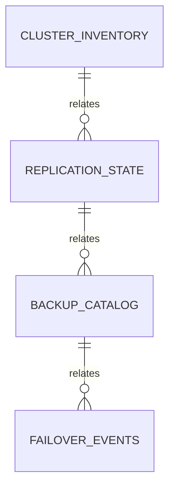

# High-Availability PostgreSQL Deployment

## Problem statement

Design primary/standby operation with tested recovery. The database must keep invariants correct during retries, concurrent requests, migrations, partial failures and operator intervention. This blueprint targets PostgreSQL 18.4.

## Requirements

- Explicit identities, ownership and lifecycle states.
- Parameterized application access and least-privilege roles.
- Measurable transaction, lock, query and recovery behavior.
- Online-compatible migration and rollback strategy.
- Tested backup, restore and failure procedures.
- Representative data and concurrency tests.

## Schema design

Core relations: **cluster inventory, replication state, backup catalog and failover events**. Stable facts remain relational; JSONB is limited to variable metadata. `cluster_id` is the main durable identity. Every tenant or ownership boundary is present in keys, foreign keys, queries and policies rather than inferred from application routing.

```sql
CREATE TABLE project_entities (
  entity_id bigint GENERATED ALWAYS AS IDENTITY PRIMARY KEY,
  owner_id bigint NOT NULL,
  state text NOT NULL CHECK (state IN ('pending', 'active', 'completed', 'failed')),
  version integer NOT NULL DEFAULT 1,
  metadata jsonb NOT NULL DEFAULT '{}',
  created_at timestamptz NOT NULL DEFAULT now(),
  updated_at timestamptz NOT NULL DEFAULT now()
);

CREATE TABLE project_events (
  event_id uuid PRIMARY KEY DEFAULT uuidv7(),
  entity_id bigint NOT NULL REFERENCES project_entities(entity_id),
  event_type text NOT NULL,
  payload jsonb NOT NULL,
  created_at timestamptz NOT NULL DEFAULT now()
);
```

## ER diagram



## Constraints

Primary and foreign keys enforce identity and ownership. `NOT NULL`, `CHECK`, `UNIQUE` and exclusion constraints encode valid states. Cross-row invariants use a transaction plus locking or serializable isolation. Application validation produces good UX; database constraints remain the final authority.

## Indexes

Use operational metadata indexes. Add indexes for foreign-key lookup and measured access paths, not every column. Verify column order, predicates and operator classes with representative plans. Track unused, duplicate and bloated indexes because each one increases write amplification and WAL.

```sql
CREATE INDEX CONCURRENTLY project_entities_owner_state_idx
ON project_entities (owner_id, state, created_at DESC)
INCLUDE (version);
```

## Transaction boundaries

A command that changes the aggregate and emits an integration event is one transaction. External HTTP, email or payment calls happen outside the database transaction through an outbox/inbox or idempotent workflow. Every retry uses a stable idempotency key.

## Isolation and locking decisions

Use fencing and single-leader promotion. Lock rows in a deterministic order. Set bounded `lock_timeout` and `statement_timeout`, and retry complete transactions only for classified transient errors such as serialization failures or deadlocks. Keep network calls outside open transactions.

## Example queries

```sql
BEGIN;

SELECT entity_id, state, version
FROM project_entities
WHERE entity_id = $1
FOR UPDATE;

UPDATE project_entities
SET state = $2,
    version = version + 1,
    updated_at = now()
WHERE entity_id = $1
  AND version = $3
RETURNING *;

INSERT INTO project_events (entity_id, event_type, payload)
VALUES ($1, $4, $5::jsonb);

COMMIT;
```

## Migration strategy

Use expand-and-contract: add nullable or compatible structures, deploy code that understands old and new forms, backfill in bounded batches, validate constraints separately, switch reads, then remove legacy structures in a later release. Use `CREATE INDEX CONCURRENTLY` outside a transaction and monitor lock waits.

## Security model

Separate owner, migration, runtime, worker, reporting and read-only roles. Revoke broad `public` privileges. Set a safe `search_path`, parameterize values, enable RLS when it is part of the isolation design, and test policies with multiple roles. Encrypt transport, protect backups and redact sensitive telemetry.

## Testing strategy

Run migration tests from realistic previous schemas. Use a disposable PostgreSQL 18.4 instance for constraints, plans and extensions. Add concurrency tests that deliberately overlap commands, property tests for invariants, failure injection around commit/acknowledgement, and restore drills from encrypted backups.

## Performance risks

Watch cardinality misestimation, hot rows, N+1 access, wide JSONB values, unbounded history, missing foreign-key indexes, offset pagination, excessive connections, long transactions and write-heavy duplicate indexes. Define expected query frequency and latency before changing configuration.

## Observability

Capture `application_name`, transaction age, waits, blockers, statement fingerprints, row estimates, WAL generation, vacuum health, replication lag and business reconciliation metrics. Dashboards link database symptoms to the operation or invariant they threaten.

## Backup and recovery

Define RPO and RTO. Combine logical exports where useful with physical backups and WAL archiving for point-in-time recovery. Encrypt and retain according to policy. A scheduled restore into an isolated environment verifies that the backup is usable and that application smoke queries pass.

## Scaling strategy

Use streaming replication, PITR and routing. Scale connection handling, reads, writes, history and analytics independently. Prefer vertical scaling and workload correction before adding distributed coordination. Document consistency changes introduced by replicas, caches or shards.

## Failure scenarios

1. Client times out after PostgreSQL commits: retry by idempotency key and return the existing result.
2. Worker crashes after claiming work: lease expiry or reconciliation makes the work eligible again.
3. Deadlock or serialization failure: roll back and retry the complete bounded transaction.
4. Replica lag: route freshness-sensitive reads to the primary.
5. Migration blocks traffic: abort on lock timeout, preserve evidence and use a safer phased plan.
6. Primary loss: fence the old primary, promote one verified standby, update routing and reconcile recovery point.

## Completion checklist

- [ ] ER model and invariants are reviewed.
- [ ] Constraints and indexes have representative tests and plans.
- [ ] Transaction, isolation, locking and retry policies are documented.
- [ ] Roles, RLS and secret handling are tested.
- [ ] Migration and rollback are rehearsed.
- [ ] Backup restore and failure scenarios pass.
- [ ] SLOs, alerts and runbooks have owners.

## Interview discussion points

Explain why the chosen transaction boundary is correct, which invariant each constraint protects, how a retry avoids duplicates, why an index key order matches the query, how the design behaves under contention, what happens after primary failure, and which metric proves the system recovered.


## Production decision record

Record assumptions about traffic, data growth, regional latency, durability, availability, tenancy, compliance and operator access. Link every major schema or topology choice to one requirement and one measurable risk. Review the decision when those assumptions change.

## Operational runbook

The runbook names an owner, safe observation queries, alert thresholds, escalation path, reversible mitigation, backup evidence, restore target, failover criteria and post-incident verification. Avoid undocumented shell history as an operational control.

